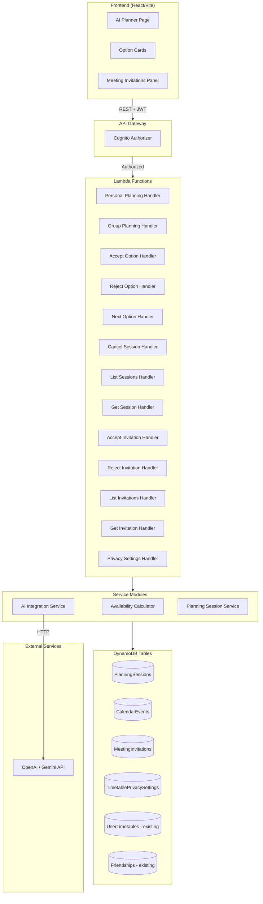
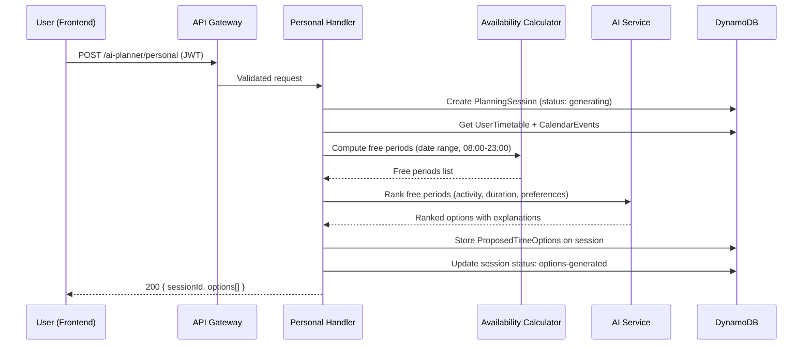
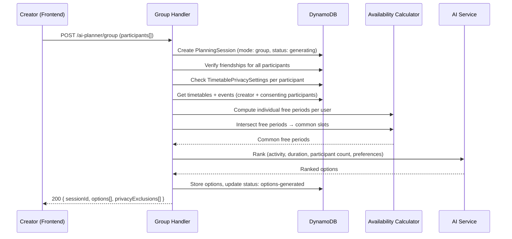

# Design Document: AI Planner Integration

## Overview

The AI Planner Integration adds intelligent scheduling capabilities to SyncCircle's existing backend infrastructure. It introduces a multi-step planning workflow: the backend retrieves authenticated user context (timetables, existing events), computes availability server-side, invokes an AI model (OpenAI/Gemini) to rank time slots, and presents interactive options through the existing chat interface. The system supports Personal Planning (individual study sessions) and Group Planning (multi-participant meetings with friends).

The design extends the existing CDK stack pattern (DynamoDB + Lambda + API Gateway + Cognito auth) with four new DynamoDB tables, a set of new Lambda handlers, and an Availability Calculator service module. The frontend enhancement converts the existing text-only AIPlanner chat page into a structured conversational interface with Option Cards and Meeting Invitation management.

### Key Design Decisions

1. **Server-side availability calculation** — All free-time computation happens in Lambda, never on the frontend, ensuring data integrity and privacy enforcement.
2. **AI as a ranking layer, not a decision layer** — The AI model receives only pre-validated free periods and returns ranked recommendations. It cannot create events or access raw timetable data.
3. **Explicit acceptance model** — No Calendar_Event is created without explicit user action via the accept-option endpoint.
4. **Privacy-first group planning** — Only aggregated free periods are shared; individual class details are never exposed to other participants or the AI model.
5. **Graceful AI degradation** — If the AI model times out, unranked free periods are returned as fallback options.

## Architecture

### System Diagram



### Request Flow — Personal Planning



### Request Flow — Group Planning



## Components and Interfaces

### Backend Service Modules

#### 1. AvailabilityCalculator (`src/services/availability-calculator.ts`)

Pure computation module — no external I/O. Takes timetable classes and calendar events as input, returns sorted non-overlapping free periods.

```typescript
interface TimeSlot {
  start: string; // ISO 8601 datetime
  end: string;   // ISO 8601 datetime
}

interface AvailabilityInput {
  timetableClasses: TimetableClass[];
  calendarEvents: CalendarEvent[];
  dateRangeStart: string; // ISO 8601 date
  dateRangeEnd: string;   // ISO 8601 date
  timezone: string;       // IANA timezone identifier
  availableHoursStart: string; // "08:00"
  availableHoursEnd: string;   // "23:00"
}

interface FreePeriod {
  start: string; // ISO 8601 datetime
  end: string;   // ISO 8601 datetime
  durationMinutes: number;
}

// Core functions
function computeFreePeriods(input: AvailabilityInput): FreePeriod[];
function intersectFreePeriods(periodsPerUser: FreePeriod[][]): FreePeriod[];
function mergeBusyPeriods(slots: TimeSlot[]): TimeSlot[];
```

**Algorithm:**
1. For each date in the range, create available window [08:00, 23:00] in local time
2. Map recurring TimetableClasses to specific dates (dayOfWeek matching)
3. Collect CalendarEvents within the date range
4. Merge overlapping/adjacent busy periods into a sorted list
5. Subtract merged busy periods from available windows
6. Filter resulting free slots by minimum duration requirement
7. For group mode: intersect individual free period lists (sorted merge intersection)

#### 2. AIIntegrationService (`src/services/ai-integration.service.ts`)

Handles communication with OpenAI/Gemini API. Implements timeout, fallback, and validation.

```typescript
interface AIRankingRequest {
  freePeriods: FreePeriod[];
  activity: string;
  durationMinutes: number;
  preferences: {
    responseStyle: 'concise' | 'detailed';
    planningAggressiveness: 'relaxed' | 'moderate' | 'aggressive';
  };
  participantCount?: number;
}

interface AIRankedOption {
  start: string;
  end: string;
  explanation: string;
  score: number;
}

interface AIRankingResponse {
  options: AIRankedOption[];
  aiAvailable: boolean;
}

async function rankTimeSlots(request: AIRankingRequest): Promise<AIRankingResponse>;
```

**Behavior:**
- 15-second timeout on AI API call
- On timeout/error: return free periods without ranking, set `aiAvailable: false`
- Post-validation: discard any AI suggestion not within a computed free period
- Never sends raw timetable data to AI — only validated FreePeriods

#### 3. PlanningSessionService (`src/services/planning-session.service.ts`)

Orchestrates the planning workflow, coordinating between repositories and services.

```typescript
interface CreatePersonalSessionRequest {
  userId: string;
  activity: string;
  durationMinutes: number;
  dateRangeStart: string;
  dateRangeEnd: string;
  preferences?: AIPreferences;
}

interface CreateGroupSessionRequest extends CreatePersonalSessionRequest {
  participantUserIds: string[];
}

interface ProposedTimeOption {
  optionId: string;
  start: string;
  end: string;
  durationMinutes: number;
  explanation: string;
  score: number;
  status: 'proposed' | 'accepted' | 'rejected';
}
```

### Lambda Handlers

Each handler follows the existing pattern: extract `userId` from `event.requestContext.authorizer.claims.sub`, validate input, call service, return via `success()`/`error()` helpers.

| Handler | Endpoint | Method | Description |
|---------|----------|--------|-------------|
| `personal-plan.ts` | `/ai-planner/personal` | POST | Create personal planning session |
| `group-plan.ts` | `/ai-planner/group` | POST | Create group planning session |
| `accept-option.ts` | `/planning-sessions/{sessionId}/accept-option` | POST | Accept a proposed time |
| `reject-option.ts` | `/planning-sessions/{sessionId}/reject-option` | POST | Reject a proposed time |
| `next-option.ts` | `/planning-sessions/{sessionId}/next-option` | POST | Request new options |
| `cancel-session.ts` | `/planning-sessions/{sessionId}/cancel` | POST | Cancel a session |
| `list-sessions.ts` | `/planning-sessions` | GET | List user's sessions |
| `get-session.ts` | `/planning-sessions/{sessionId}` | GET | Get session detail |
| `accept-invitation.ts` | `/meeting-invitations/{invitationId}/accept` | POST | Accept meeting invite |
| `reject-invitation.ts` | `/meeting-invitations/{invitationId}/reject` | POST | Reject meeting invite |
| `list-invitations.ts` | `/meeting-invitations` | GET | List pending invitations |
| `get-invitation.ts` | `/meeting-invitations/{invitationId}` | GET | Get invitation detail |
| `put-privacy.ts` | `/timetable/privacy` | PUT | Update privacy setting |
| `get-privacy.ts` | `/timetable/privacy` | GET | Get privacy setting |

### Frontend Components

The existing `AIPlanner.tsx` page will be enhanced with:

| Component | Responsibility |
|-----------|---------------|
| `PlannerModeSelector` | Toggle between Personal / Plan with Friends modes |
| `FriendSelector` | Checkbox list of active friends for group mode |
| `PlanningRequestForm` | Activity, duration, date range inputs |
| `OptionCard` | Displays a proposed time with Accept/Find Another buttons |
| `InvitationBadge` | Notification count for pending invitations |
| `InvitationCard` | Displays invitation details with Accept/Reject buttons |
| `PlanningSessionList` | History of past planning sessions |
| `EmptyState` | Contextual empty states (no friends, no slots, errors) |

## Data Models

### PlanningSessions Table

| Attribute | Type | Key | Description |
|-----------|------|-----|-------------|
| `sessionId` | String | PK | UUID, unique identifier |
| `creatorUserId` | String | GSI-PK | Authenticated user who created the session |
| `mode` | String | — | `"personal"` or `"group"` |
| `status` | String | — | `"draft"` \| `"generating"` \| `"options-generated"` \| `"creator-accepted"` \| `"confirmed"` \| `"cancelled"` \| `"rejected"` |
| `activity` | String | — | Description of the planned activity |
| `durationMinutes` | Number | — | Requested duration (15–480) |
| `dateRangeStart` | String | — | ISO 8601 date |
| `dateRangeEnd` | String | — | ISO 8601 date |
| `participantUserIds` | List<String> | — | Selected friends (group mode only) |
| `proposedOptions` | List<Map> | — | Array of `ProposedTimeOption` objects |
| `excludedOptions` | List<Map> | — | Previously rejected time slots |
| `acceptedOptionId` | String | — | The option the creator accepted |
| `privacyExclusions` | List<String> | — | UserIds whose timetable was excluded |
| `preferences` | Map | — | AI preferences (responseStyle, aggressiveness) |
| `createdAt` | String | GSI-SK | ISO 8601 timestamp |
| `updatedAt` | String | — | ISO 8601 timestamp |

**GSI:** `creatorUserId-createdAt-index` (PK: `creatorUserId`, SK: `createdAt`) — for listing user's sessions ordered by recency.

### CalendarEvents Table

| Attribute | Type | Key | Description |
|-----------|------|-----|-------------|
| `userId` | String | PK | Owner of this event |
| `startDateTime` | String | SK | ISO 8601 start time (enables range queries) |
| `eventId` | String | — | UUID, unique event identifier |
| `title` | String | — | Event title/activity name |
| `endDateTime` | String | — | ISO 8601 end time |
| `durationMinutes` | Number | — | Duration in minutes |
| `location` | String | — | Optional location |
| `planningSessionId` | String | — | Link back to the originating session |
| `participantUserIds` | List<String> | — | Other participants (group events) |
| `status` | String | — | `"active"` \| `"cancelled"` |
| `createdAt` | String | — | ISO 8601 timestamp |
| `updatedAt` | String | — | ISO 8601 timestamp |

**Access patterns:**
- Get all events for a user in a date range: Query PK=userId, SK between dateRangeStart and dateRangeEnd
- Get a specific event: Query PK=userId, SK=startDateTime (or scan with filter on eventId)

**GSI:** `eventId-index` (PK: `eventId`) — for direct event lookup by ID (used during cancellation).

### MeetingInvitations Table

| Attribute | Type | Key | Description |
|-----------|------|-----|-------------|
| `invitationId` | String | PK | UUID, unique identifier |
| `planningSessionId` | String | — | Links to the originating session |
| `eventId` | String | — | Links to the created Calendar_Event |
| `senderUserId` | String | — | The Creator who sent the invitation |
| `receiverUserId` | String | GSI-PK | The Participant receiving the invitation |
| `status` | String | — | `"pending"` \| `"accepted"` \| `"rejected"` \| `"expired"` \| `"cancelled"` |
| `createdAt` | String | GSI-SK | ISO 8601 timestamp |
| `respondedAt` | String | — | ISO 8601 timestamp (when responded) |
| `expiresAt` | String | — | ISO 8601 timestamp (createdAt + 72h) |

**GSI:** `receiverUserId-createdAt-index` (PK: `receiverUserId`, SK: `createdAt`) — for listing a user's incoming invitations.

**GSI:** `planningSessionId-index` (PK: `planningSessionId`) — for querying all invitations for a session during cancellation.

### TimetablePrivacySettings Table

| Attribute | Type | Key | Description |
|-----------|------|-----|-------------|
| `userId` | String | PK | The user this setting belongs to |
| `visibility` | String | — | `"friends"` \| `"none"` (default: `"friends"`) |
| `updatedAt` | String | — | ISO 8601 timestamp |

**Behavior:** If no record exists for a user, the system defaults to `"friends"` (opt-out model).

## Correctness Properties

*A property is a characteristic or behavior that should hold true across all valid executions of a system — essentially, a formal statement about what the system should do. Properties serve as the bridge between human-readable specifications and machine-verifiable correctness guarantees.*

### Property 1: Free period computation round-trip consistency

*For any* valid user schedule (timetable classes + calendar events) and any event scheduled within a returned free period, recomputing free periods after adding that event SHALL show the new event's time slot as occupied (no longer free).

**Validates: Requirements 10.4**

### Property 2: Merged busy periods produce non-overlapping sorted output

*For any* list of busy time slots (possibly overlapping or adjacent), merging them SHALL produce a sorted list of non-overlapping intervals where no two intervals share any time point.

**Validates: Requirements 10.5**

### Property 3: Free periods fall within available hours

*For any* computation of free periods, every returned free period's start and end time SHALL fall within the 08:00–23:00 local time window on its respective date.

**Validates: Requirements 10.3**

### Property 4: Group intersection is subset of individual availability

*For any* set of individual free period lists, the intersected common free periods SHALL be a subset (in time coverage) of every individual participant's free periods.

**Validates: Requirements 10.6**

### Property 5: AI recommendations are validated against free periods

*For any* AI-ranked time slot presented to the user, that slot SHALL fall entirely within a previously computed free period. Any AI recommendation that does not satisfy this SHALL be discarded.

**Validates: Requirements 11.4, 11.5**

### Property 6: No event creation without explicit acceptance

*For any* planning session, no Calendar_Event SHALL exist linked to that session unless the accept-option endpoint has been successfully called by the Creator for that session.

**Validates: Requirements 3.6**

### Property 7: Privacy exclusion prevents timetable leakage

*For any* group planning request where a participant's Timetable_Privacy_Setting is "none", the API response and AI input SHALL NOT contain that participant's timetable data, class titles, module codes, or locations.

**Validates: Requirements 8.3, 18.1, 18.3, 18.4**

### Property 8: Session modification restricted to Creator

*For any* planning session, modification operations (accept-option, reject-option, cancel, next-option) SHALL succeed only when the authenticated user matches the session's creatorUserId.

**Validates: Requirements 12.4**

### Property 9: Input validation rejects out-of-range values

*For any* planning request with duration outside [15, 480] minutes, OR dateRangeStart in the past, OR dateRangeEnd more than 30 days after dateRangeStart, OR participantUserIds count outside [1, 10] for group mode, the system SHALL reject with VALIDATION_ERROR.

**Validates: Requirements 13.1, 13.2, 13.3, 13.4**

### Property 10: Cancellation cascades to invitations and events

*For any* planning session that is cancelled, all associated pending Meeting_Invitations SHALL transition to "cancelled" status, and all associated Calendar_Events (creator + accepted participants) SHALL be deleted.

**Validates: Requirements 6.2, 6.3**

## Error Handling

### Error Codes (extending `@synccircle/shared`)

| Code | HTTP Status | Trigger |
|------|-------------|---------|
| `CONTEXT_UNAVAILABLE` | 503 | Cannot retrieve user's timetable/event data |
| `NOT_FRIENDS` | 403 | Participant is not an active friend of the creator |
| `SLOT_CONFLICT` | 409 | Selected time slot is no longer available on revalidation |
| `VALIDATION_ERROR` | 400 | Input fails validation (duration, date range, participants) |
| `RATE_LIMITED` | 429 | More than 5 planning requests/user/minute |
| `FORBIDDEN` | 403 | User is not authorized for this operation |
| `UNAUTHORIZED` | 401 | Missing or invalid JWT |
| `NO_AVAILABILITY` | 200 | No free periods found (informational, not error) |
| `AI_UNAVAILABLE` | 200 | AI timed out; returning unranked options (informational) |

### Failure Modes and Recovery

| Scenario | Behavior |
|----------|----------|
| AI timeout (>15s) | Return unranked free periods with `aiAvailable: false` |
| DynamoDB read failure | Return 503 `CONTEXT_UNAVAILABLE`, session stays in "draft" |
| Friendship verification fails for some participants | Reject entire request with `NOT_FRIENDS` listing invalid IDs |
| Slot conflict on acceptance | Return 409 `SLOT_CONFLICT`, suggest requesting new options |
| No common free periods (group) | Return success with empty options + suggestion message |
| Invitation expires (72h) | Background or on-read: mark as "expired" |
| Rate limit exceeded | Return 429 with `Retry-After` header |

### Idempotency Considerations

- Accept-option: If already accepted, return the existing event (idempotent)
- Cancel: If already cancelled, return success (idempotent)
- Invitation response: If already responded, return current status (idempotent)

## Testing Strategy

### Property-Based Testing (PBT)

The Availability Calculator is a pure computational module well-suited for property-based testing. We will use **fast-check** (TypeScript PBT library) with minimum 100 iterations per property.

**PBT Target:** `src/services/availability-calculator.ts`

Properties to test:
1. Round-trip consistency (Property 1)
2. Merged intervals are non-overlapping and sorted (Property 2)
3. Free periods within available hours (Property 3)
4. Group intersection is subset of individual (Property 4)
5. Input validation rejects invalid ranges (Property 9)

**Test Configuration:**
- Library: `fast-check`
- Minimum iterations: 100 per property
- Tag format: `Feature: ai-planner-integration, Property {N}: {description}`

### Unit Testing (Example-Based)

| Module | Test Focus |
|--------|-----------|
| `ai-integration.service.ts` | Timeout handling, response validation, fallback behavior |
| `planning-session.service.ts` | Status transitions, authorization checks, cascade logic |
| Lambda handlers | Input validation, error responses, auth extraction |
| Privacy enforcement | Timetable exclusion, response sanitization |

### Integration Testing

| Scenario | Coverage |
|----------|----------|
| Full personal planning flow | Session creation → options → accept → event created |
| Full group planning flow | Session → friendship check → privacy → options → accept → invitations |
| Cancellation cascade | Cancel session → invitations cancelled → events deleted |
| Invitation lifecycle | Create → accept/reject → session status update |

### Frontend Testing

- Component tests for OptionCard, InvitationCard, PlannerModeSelector
- Integration tests for API call flows (mock API responses)
- Empty state rendering tests
