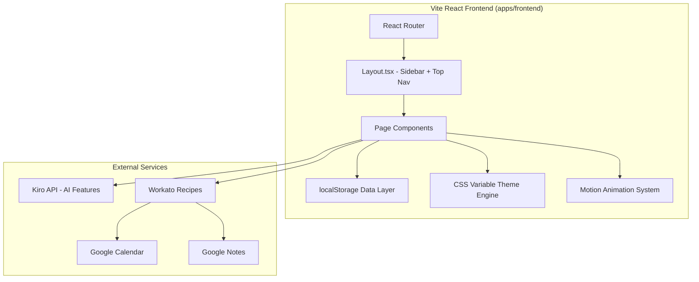
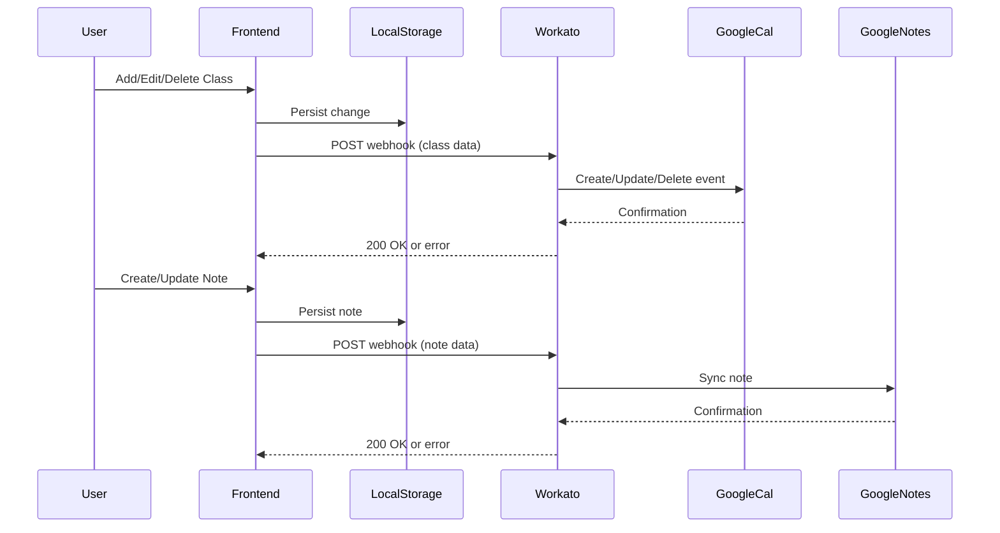
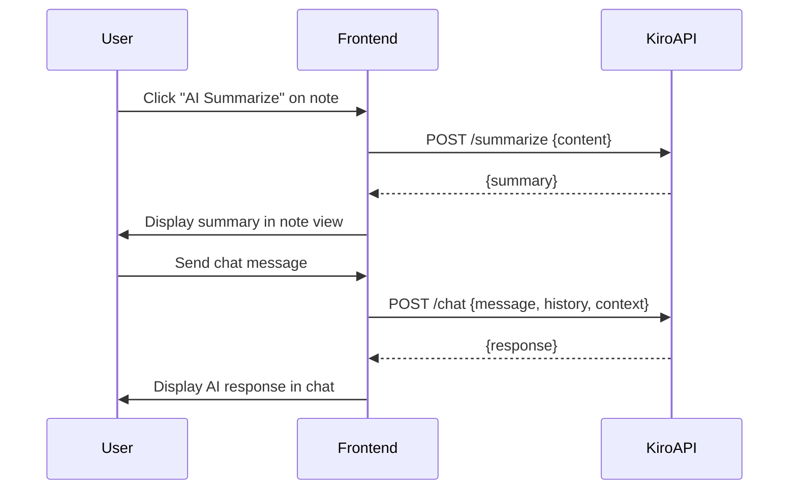

# Design Document: CramCircle

## Overview

CramCircle (SyncCircle) is a student collaboration web app for the AWS Kiro BuildFest 2026 Hackathon. It enables classmates to coordinate schedules, share study material, plan sessions with AI assistance, and communicate — all from a single Vite React frontend with Workato-powered backend integrations.

The architecture follows a **frontend-heavy + webhook-based backend** pattern: the React SPA handles all user interactions and local state, while Workato recipes manage external integrations (Google Calendar, Google Notes). AI features (summarization, chat planner) call the Kiro API directly from the frontend.

### Key Design Decisions

1. **localStorage-first persistence** — For hackathon speed, all user data (classes, tasks, notes, settings, friends) is stored in localStorage. Workato webhooks sync relevant data to Google services asynchronously.
2. **Workato as backend** — No traditional server. Workato recipes act as the integration layer, triggered via webhooks from the frontend.
3. **Kiro API for AI** — Note summarization and the AI Planner chatbot use Kiro API endpoints, called directly from the frontend.
4. **CSS variable theming** — The existing theme system uses CSS custom properties in `theme.css`, making theme switching a matter of updating variable values.
5. **Motion animation library** — Already integrated for page transitions and UI micro-interactions; extended for the Profile Character animations.

## Architecture



### System Layers

| Layer | Technology | Responsibility |
|-------|-----------|---------------|
| UI Components | React + Radix UI + Tailwind CSS | Render pages, handle user input |
| State & Persistence | localStorage + React state | Store user data, hydrate on load |
| Theming | CSS custom properties (theme.css) | Color schemes, font sizes, dark mode |
| Animation | Motion (framer-motion) | Page transitions, character animations |
| AI Integration | Kiro API (fetch calls) | Note summarization, chat planner |
| Backend Integration | Workato webhooks | Google Calendar sync, Google Notes sync |
| Routing | React Router v7 | SPA navigation, protected routes |

## Components and Interfaces

### Page Component Structure

```text
src/app/
├── components/
│   ├── Layout.tsx              # Sidebar nav + top bar + Outlet
│   ├── ui/                     # Radix UI primitives (button, dialog, tabs, etc.)
│   ├── ProfileCharacter.tsx    # Animated study character (Motion)
│   ├── FriendOverlay.tsx       # Friend availability overlay on calendar
│   ├── ThemeProvider.tsx       # CSS variable theme switcher
│   └── AISummarizeButton.tsx   # Kiro API summarization trigger
├── pages/
│   ├── Auth.tsx                # Login / Register / Forgot Password
│   ├── Dashboard.tsx           # Overview: tasks, schedule, activity
│   ├── Timetable.tsx           # Calendar + Tasks tabs, friend overlay
│   ├── Notes.tsx               # User Notes + Shared Notes tabs
│   ├── AIPlanner.tsx           # Kiro API chatbot interface
│   ├── Friends.tsx             # Friend list, requests, search
│   ├── GroupChat.tsx           # Real-time group messaging
│   ├── Profile.tsx             # User profile + animated character
│   └── Settings.tsx            # All settings sections
├── hooks/
│   ├── useLocalStorage.ts      # Generic localStorage read/write hook
│   ├── useTheme.ts             # Theme selection and persistence
│   ├── useKiroAPI.ts           # Kiro API fetch wrapper
│   └── useWorkato.ts           # Workato webhook trigger wrapper
├── lib/
│   ├── storage.ts              # localStorage CRUD helpers
│   ├── validators.ts           # Form validation (email, password, class times)
│   ├── theme-config.ts         # Theme definitions (CSS variable maps)
│   └── workato-client.ts       # Workato webhook URL config + fetch
├── types/
│   └── index.ts                # TypeScript interfaces for all entities
└── routes.tsx                  # React Router config
```

### Key Interfaces

```typescript
// Kiro API Client Interface
interface KiroAPIClient {
  summarizeNote(content: string): Promise<{ summary: string }>;
  chatMessage(
    message: string,
    history: ChatMessage[],
    context: UserContext
  ): Promise<{ response: string }>;
}

// Workato Webhook Interface
interface WorkatoClient {
  syncClass(action: 'create' | 'update' | 'delete', classData: TimetableClass): Promise<void>;
  syncNote(action: 'create' | 'update', noteData: Note): Promise<void>;
  connectGoogleCalendar(userId: string): Promise<{ connected: boolean }>;
  connectGoogleNotes(userId: string): Promise<{ connected: boolean }>;
  disconnectGoogleCalendar(userId: string): Promise<void>;
}

// Theme Engine Interface
interface ThemeEngine {
  currentTheme: ThemeName;
  applyTheme(theme: ThemeName): void;
  getAvailableThemes(): ThemeDefinition[];
  persistTheme(theme: ThemeName): void;
  loadPersistedTheme(): ThemeName | null;
}

// localStorage Data Layer Interface
interface StorageLayer {
  getClasses(): TimetableClass[];
  saveClass(cls: TimetableClass): void;
  deleteClass(id: string): void;
  getTasks(): Task[];
  saveTask(task: Task): void;
  deleteTask(id: string): void;
  getNotes(): Note[];
  saveNote(note: Note): void;
  getFriends(): Friend[];
  saveFriend(friend: Friend): void;
  removeFriend(id: string): void;
  getSettings(): UserSettings;
  saveSettings(settings: UserSettings): void;
  getGroups(): StudyGroup[];
  joinGroup(group: StudyGroup): void;
}
```

### Integration Flow: Workato Webhooks



### Integration Flow: Kiro API



## Data Models

### Core Entities (localStorage)

```typescript
interface User {
  id: string;
  email: string;
  displayName: string;
  avatar?: string;
  course?: string;
  createdAt: string;
}

interface TimetableClass {
  id: string;
  title: string;
  moduleCode: string;
  location: string;
  dayOfWeek: 0 | 1 | 2 | 3 | 4; // Mon-Fri
  startTime: string; // "HH:mm" format
  endTime: string;   // "HH:mm" format
  color: string;
  source: 'personal' | 'imported';
}

interface Task {
  id: string;
  title: string;
  dueDate?: string;        // ISO date string
  priority: 'High' | 'Medium' | 'Low';
  completed: boolean;
  completedAt?: string;
  createdAt: string;
}

interface Note {
  id: string;
  title: string;
  content: string;
  folderId: string;
  ownerId: string;
  sharedGroupIds: string[];
  summary?: string;
  createdAt: string;
  updatedAt: string;
}

interface Folder {
  id: string;
  name: string;
  color: string;
  ownerId: string;
  type: 'personal' | 'group';
  groupId?: string;
}

interface StudyGroup {
  id: string;
  name: string;
  passwordHash: string; // 4-digit pin hashed
  members: string[];    // user IDs
  createdAt: string;
}

interface Friend {
  id: string;
  userId: string;
  friendId: string;
  displayName: string;
  status: 'online' | 'offline' | 'studying';
  timetable: TimetableClass[]; // for availability overlay
}

interface ChatMessage {
  id: string;
  groupId: string;
  senderId: string;
  senderName: string;
  content: string;
  timestamp: string;
}

interface UserSettings {
  appearance: {
    theme: ThemeName;
    fontSize: 'small' | 'medium' | 'large';
  };
  notifications: {
    push: boolean;
    email: boolean;
  };
  privacy: {
    profileVisibility: 'public' | 'friends' | 'private';
    dataSharing: boolean;
  };
  accessibility: {
    highContrast: boolean;
    reducedMotion: boolean;
  };
  profile: {
    displayName: string;
    avatar: string;
    course: string;
  };
  aiPreferences: {
    responseStyle: 'concise' | 'detailed' | 'balanced';
    planningAggressiveness: 'relaxed' | 'moderate' | 'intensive';
  };
}

type ThemeName = 'darker-purple' | 'ocean-blue' | 'forest-green' | 'sunset-warm' | 'midnight-dark';

interface ThemeDefinition {
  name: ThemeName;
  label: string;
  variables: Record<string, string>; // CSS variable name -> value
}
```

### localStorage Key Schema

| Key | Type | Description |
|-----|------|-------------|
| `synccircle_auth` | `"true" \| null` | Authentication flag (existing) |
| `synccircle_user` | `User` | Current user profile |
| `synccircle_classes` | `TimetableClass[]` | User's timetable entries |
| `synccircle_tasks` | `Task[]` | User's task list |
| `synccircle_notes` | `Note[]` | All user notes |
| `synccircle_folders` | `Folder[]` | Note folder structure |
| `synccircle_friends` | `Friend[]` | Friend list with timetables |
| `synccircle_groups` | `StudyGroup[]` | Joined study groups |
| `synccircle_messages` | `ChatMessage[]` | Group chat history |
| `synccircle_settings` | `UserSettings` | All user preferences |
| `synccircle_theme` | `ThemeName` | Active theme (quick access) |
| `synccircle_chat_history` | `ChatMessage[]` | AI Planner conversation |

### Theme System Design

The existing `theme.css` uses CSS custom properties on `:root`. Theme switching works by:

1. Defining theme presets in `lib/theme-config.ts` as objects mapping variable names to values
2. On theme selection, iterating over the preset and calling `document.documentElement.style.setProperty()` for each variable
3. Persisting the selected theme name to `localStorage` under `synccircle_theme`
4. On app load, `ThemeProvider` reads the persisted theme and applies it before first paint

The default "darker-purple" theme uses the existing values in `theme.css` (primary: `#b8a4d4`, secondary: `#f4b8d0`).

### Profile Character Animation Design

The Profile Character uses Motion's `variants` API with three states:

- **idle** — Subtle breathing/floating animation (scale oscillation, gentle Y translation)
- **studying** — Head-bob and pencil-writing motion (rotation keyframes)
- **celebration** — Confetti burst + jump animation (triggered via `canvas-confetti` + Motion spring)

State transitions are driven by user actions (task completion triggers celebration) and default to idle when no interaction is active.

## Correctness Properties

*A property is a characteristic or behavior that should hold true across all valid executions of a system — essentially, a formal statement about what the system should do. Properties serve as the bridge between human-readable specifications and machine-verifiable correctness guarantees.*

### Property 1: Registration validation rejects invalid inputs

*For any* email string that does not match a valid email format, OR any password shorter than 8 characters, submitting the registration form SHALL be rejected with a validation error, and no user account shall be created.

**Validates: Requirements 2.4, 2.5**

### Property 2: Login failure message is generic

*For any* invalid credential pair (wrong email, wrong password, or both), the authentication error message SHALL be identical regardless of which field is incorrect, never revealing whether the email exists.

**Validates: Requirements 2.5**

### Property 3: Dashboard renders all data sections

*For any* set of upcoming tasks, schedule entries, and collaboration activity items stored in localStorage, the Dashboard page SHALL render content from all three sections.

**Validates: Requirements 3.1**

### Property 4: Valid class creation persists and displays

*For any* valid class object (all required fields present, end time strictly after start time), submitting the add-class form SHALL persist the class to localStorage and display it in the calendar grid at the correct day/time position.

**Validates: Requirements 4.2**

### Property 5: Invalid class data is rejected

*For any* class form submission with a missing required field (title, module code, location, day, start time, end time) OR an end time that is not after the start time, the form SHALL display a validation error and NOT persist any data.

**Validates: Requirements 4.5**

### Property 6: Class and task deletion removes entity

*For any* class or task that exists in localStorage, deleting it SHALL remove it from storage and from the rendered view, and the remaining items SHALL be unchanged.

**Validates: Requirements 4.4, 6.6**

### Property 7: Friend overlay round-trip

*For any* friend, selecting them in the Friend Availability Dropdown and then immediately deselecting them SHALL restore the calendar view to its original state (no overlay elements from that friend remain).

**Validates: Requirements 5.3, 5.4**

### Property 8: Free slot computation correctness

*For any* set of timetables (user + selected friends), the highlighted free slots SHALL be exactly those time slots where NONE of the participants have a scheduled class. A slot is free if and only if no timetable entry overlaps it.

**Validates: Requirements 5.5**

### Property 9: Task creation persists with all fields

*For any* valid task (non-empty title, optional due date, optional priority from {High, Medium, Low}), creating the task SHALL persist it to localStorage with all provided fields and display it in the active task list.

**Validates: Requirements 6.4**

### Property 10: Task completion is a one-way state transition

*For any* active task, marking it complete SHALL move it to the completed section. The task SHALL no longer appear in the active section, and its `completed` flag SHALL be `true` in localStorage.

**Validates: Requirements 6.5**

### Property 11: Notes display under assigned folders

*For any* set of notes each assigned to a folder, the "User's Notes" tab SHALL render every note grouped under its assigned folder. No note SHALL appear outside its folder or be missing.

**Validates: Requirements 7.2, 7.3, 7.4**

### Property 12: Shared notes filtered by group membership

*For any* set of notes shared across multiple Study Groups, the "Shared Notes" tab SHALL display only notes belonging to groups the current user is a member of, organized into folders named after each group.

**Validates: Requirements 7.5, 7.6**

### Property 13: AI summary display

*For any* non-empty summary string returned by the Kiro API, the Notes page SHALL display that exact summary text within the note view.

**Validates: Requirements 8.3**

### Property 14: Group join with valid credentials succeeds

*For any* valid group name and correct 4-digit password combination, submitting the join form SHALL add the user to the group's member list and display the group's shared notes.

**Validates: Requirements 9.3**

### Property 15: Group join error is generic

*For any* incorrect group name OR incorrect 4-digit password, the error message SHALL be identical and SHALL NOT reveal which field was wrong.

**Validates: Requirements 9.4**

### Property 16: Chat conversation history accumulates

*For any* sequence of N messages sent in the AI Planner, the chat thread SHALL contain all N user messages and their corresponding AI responses in chronological order. The Kiro API request SHALL include the full conversation history as context.

**Validates: Requirements 11.2, 11.6**

### Property 17: Friend list renders all friends with required data

*For any* friend list stored in localStorage, the Friends page SHALL render every friend with their display name and online status visible.

**Validates: Requirements 12.1**

### Property 18: Friendship is bidirectional

*For any* two users, accepting a friend request SHALL add each user to the other's friend list. Removing the friendship SHALL remove each user from the other's friend list.

**Validates: Requirements 12.3, 12.4**

### Property 19: Friend search returns matching users

*For any* search query string, the friend search results SHALL contain only users whose display name or email contains the query as a substring (case-insensitive).

**Validates: Requirements 12.5**

### Property 20: Theme application updates CSS variables

*For any* theme from the available theme list, selecting it SHALL update all CSS custom properties on `document.documentElement` to match the theme's defined values.

**Validates: Requirements 14.3**

### Property 21: Theme persistence round-trip

*For any* selected theme, persisting it to localStorage and then loading it on a fresh page load SHALL result in the same theme being active (CSS variables match the selected theme).

**Validates: Requirements 14.4**

### Property 22: Settings persistence round-trip

*For any* settings section (appearance, notifications, privacy, accessibility, profile, AI preferences) and any valid preference value, saving the setting SHALL persist it to localStorage, and reading settings on next load SHALL return the saved value unchanged.

**Validates: Requirements 15.2, 15.3, 15.4, 15.5, 15.6, 15.7**

### Property 23: Workato class field mapping

*For any* valid TimetableClass object, the Workato webhook payload SHALL contain all CramCircle fields (title, moduleCode, location, dayOfWeek, startTime, endTime) mapped to their corresponding Google Calendar event fields.

**Validates: Requirements 17.3**

### Property 24: Friend availability dropdown renders all friends

*For any* friend list, opening the Friend Availability Dropdown SHALL display a checkbox for every friend in the list, with no friends missing or duplicated.

**Validates: Requirements 5.2**

### Property 25: Group chat messages display for all members

*For any* message sent in a group chat, the message SHALL appear in the chat thread, and opening the chat SHALL display the full message history in chronological order.

**Validates: Requirements 13.2, 13.3**

## Error Handling

### Error Categories and Strategies

| Category | Trigger | User Experience | Recovery |
|----------|---------|-----------------|----------|
| Validation Error | Invalid form input | Inline field-level error messages | User corrects input |
| API Timeout | Kiro API > 30s (summarize) or > 10s (chat) | Toast notification with timeout message | Retry button |
| API Error | Kiro API 4xx/5xx | User-friendly error in context | Retry button |
| Sync Failure | Workato webhook fails | Toast notification "Sync failed" | Auto-retry + manual retry |
| Auth Failure | Invalid credentials | Generic error message (security) | User retries |
| Storage Error | localStorage quota exceeded | Warning toast | Suggest clearing old data |

### Error Handling Patterns

```typescript
// Kiro API error handling wrapper
async function callKiroAPI<T>(
  endpoint: string,
  payload: unknown,
  timeoutMs: number
): Promise<{ data?: T; error?: string }> {
  const controller = new AbortController();
  const timer = setTimeout(() => controller.abort(), timeoutMs);

  try {
    const res = await fetch(endpoint, {
      method: 'POST',
      headers: { 'Content-Type': 'application/json' },
      body: JSON.stringify(payload),
      signal: controller.signal,
    });
    clearTimeout(timer);

    if (!res.ok) {
      return { error: 'Something went wrong. Please try again.' };
    }
    return { data: await res.json() };
  } catch (err) {
    clearTimeout(timer);
    if (err instanceof DOMException && err.name === 'AbortError') {
      return { error: 'Request timed out. Please try again.' };
    }
    return { error: 'Unable to connect. Please check your connection.' };
  }
}
```

### Workato Webhook Error Handling

Workato sync operations are fire-and-forget with notification on failure:

1. Frontend makes the webhook call after persisting locally (optimistic update)
2. If webhook returns non-2xx, show a toast: "Sync to Google Calendar failed. Your changes are saved locally."
3. Store failed syncs in `synccircle_pending_syncs` for retry
4. On next successful app load, retry pending syncs automatically

### Validation Error Display

- Form validation uses `lib/validators.ts` for pure validation functions
- Errors display inline below the relevant field
- Auth errors are intentionally generic (don't reveal which field failed)
- Class form validates: all fields present + `endTime > startTime`
- Task form validates: non-empty title
- Group join form validates: non-empty group name + exactly 4 numeric digits

## Testing Strategy

### Testing Approach

The project uses a dual testing strategy:

1. **Property-based tests** (fast-check) — Verify universal correctness properties across generated inputs. Minimum 100 iterations per property.
2. **Example-based unit tests** (Vitest) — Verify specific UI interactions, edge cases, and integration points.

### Property-Based Testing

- **Library**: `fast-check` with Vitest as the test runner
- **Location**: `SyncCircle/tests/properties/`
- **Configuration**: Each property test runs minimum 100 iterations
- **Tagging**: Each test is annotated with `// Feature: cram-circle, Property N: <title>`

Property tests focus on:
- Data layer logic (localStorage CRUD, validation, filtering)
- Theme system (application + persistence round-trip)
- Free slot computation algorithm
- Field mapping for Workato payloads
- Friend search filtering
- Note organization and group membership filtering

### Unit / Integration Tests

- **Framework**: Vitest + React Testing Library
- **Location**: `SyncCircle/tests/unit/` and `SyncCircle/tests/integration/`
- **Coverage**: UI interactions, component rendering, API mocking

Unit tests focus on:
- Navigation (SyncCircle icon -> Dashboard, tab switching)
- Form submissions (add class, create task, join group)
- Feature flag behavior (group chat enable/disable)
- Error states (API timeout, validation failures)
- Animation state triggers (task completion -> celebration)

### Integration Tests

Integration tests verify Workato webhook calls and Kiro API interactions using mocked HTTP:

- Verify webhook payload structure matches Google Calendar event schema
- Verify Kiro API request includes conversation history for chat
- Verify retry behavior on failed syncs

### Test File Structure

```text
SyncCircle/tests/
├── properties/
│   ├── validators.property.test.ts    # Properties 1, 2, 5
│   ├── storage.property.test.ts       # Properties 4, 6, 9, 10, 22
│   ├── timetable.property.test.ts     # Properties 7, 8, 24
│   ├── notes.property.test.ts         # Properties 11, 12, 13
│   ├── friends.property.test.ts       # Properties 17, 18, 19
│   ├── groups.property.test.ts        # Properties 14, 15, 25
│   ├── theme.property.test.ts         # Properties 20, 21
│   ├── chat.property.test.ts          # Property 16
│   ├── dashboard.property.test.ts     # Property 3
│   └── workato.property.test.ts       # Property 23
├── unit/
│   ├── Layout.test.tsx
│   ├── Timetable.test.tsx
│   ├── Notes.test.tsx
│   ├── Settings.test.tsx
│   ├── ProfileCharacter.test.tsx
│   └── Auth.test.tsx
└── integration/
    ├── workato-sync.test.ts
    └── kiro-api.test.ts
```
