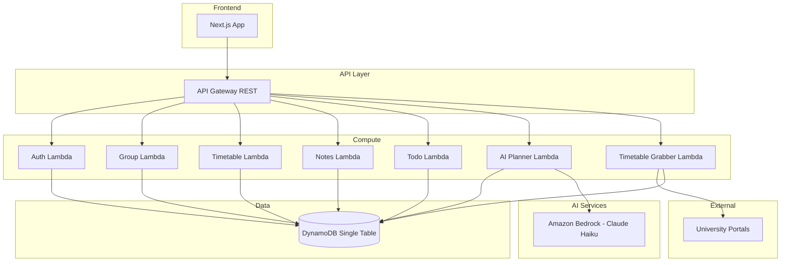

# Design Document: CramCircle

## Overview

CramCircle is a full-stack educational dashboard that eliminates administrative burden for students by unifying shared group timetables, personal schedule blocking, collaborative notes, and an AI-driven scheduling assistant. The system targets the AWS Kiro BuildFest 2026 "Most Practical Solution" category.

**Key Design Decisions:**
- **Monorepo TypeScript** — shared types between frontend and backend reduce integration bugs
- **AWS Serverless** — Lambda + API Gateway + DynamoDB for zero-ops and free-tier friendliness during hackathon
- **Amazon Bedrock (Claude Haiku)** — lightweight, cost-effective model for natural language scheduling queries
- **Single-table DynamoDB design** — optimized for the primary access pattern: overlapping time range queries across group members
- **Next.js frontend** — server-side rendering for fast initial load, React for rich calendar interactions

## Architecture



**Architectural Rationale:**
- Each domain (auth, groups, timetable, notes, todo, AI) maps to a separate Lambda function for independent scaling and deployment
- API Gateway provides a unified REST endpoint with JWT authorizer for token validation
- DynamoDB single-table design avoids joins and enables efficient access patterns for the primary use case: finding free windows across multiple members
- Amazon Bedrock integration avoids self-hosting ML infrastructure while staying within AWS ecosystem

## Components and Interfaces

### 1. Authentication Service (`/api/auth`)

| Endpoint | Method | Description |
|----------|--------|-------------|
| `/auth/register` | POST | Create account, return JWT |
| `/auth/login` | POST | Authenticate, return JWT |

**Internal Interfaces:**
- `hashPassword(password: string): Promise<string>` — bcrypt hashing with salt rounds = 12
- `verifyPassword(password: string, hash: string): Promise<boolean>`
- `generateToken(userId: string): string` — JWT with 24h expiry, signed with HMAC-SHA256
- `validateToken(token: string): TokenPayload | null`
- `checkRateLimit(email: string): { blocked: boolean; remainingAttempts: number }`

### 2. Group Service (`/api/groups`)

| Endpoint | Method | Description |
|----------|--------|-------------|
| `/groups` | POST | Create group |
| `/groups` | GET | List user's groups |
| `/groups/:id` | GET | Get group details + members |
| `/groups/:id/leave` | POST | Leave group |
| `/groups/join/:inviteCode` | POST | Join via invite link |

**Internal Interfaces:**
- `generateInviteCode(): string` — 8-character URL-safe random string
- `validateMembershipLimit(userId: string): Promise<boolean>` — checks < 50 groups
- `getGroupMembers(groupId: string): Promise<Member[]>`

### 3. Timetable Service (`/api/events`)

| Endpoint | Method | Description |
|----------|--------|-------------|
| `/events/academic` | POST | Create academic event |
| `/events/academic/:id` | PUT | Update academic event |
| `/events/academic/:id` | DELETE | Delete academic event |
| `/events/personal` | POST | Create personal event |
| `/events/personal/:id` | PUT | Update personal event |
| `/events/personal/:id` | DELETE | Delete personal event |
| `/events/categories` | POST | Create event category |
| `/events/categories/:id` | PUT | Update category |
| `/events/categories/:id` | DELETE | Delete category |
| `/events?start=&end=` | GET | Get own timetable (date range) |
| `/events/group/:groupId?start=&end=` | GET | Get group timetable (privacy-masked) |

**Internal Interfaces:**
- `expandRecurrence(event: RecurringEvent, start: Date, end: Date): EventOccurrence[]` — generates occurrences within range
- `maskPersonalEvents(events: PersonalEvent[]): BusyBlock[]` — strips title/category, keeps only time range
- `detectConflicts(newEvents: Event[], existingEvents: Event[]): Conflict[]`
- `validateTimeRange(start: Date, end: Date): ValidationResult` — ensures end > start, range ≤ 90 days

### 4. Timetable Grabber Service (`/api/grabber`)

| Endpoint | Method | Description |
|----------|--------|-------------|
| `/grabber/extract` | POST | Initiate timetable extraction from university portal |
| `/grabber/confirm` | POST | Confirm and import extracted events |
| `/grabber/ics` | POST | Upload and parse ICS file |

**Internal Interfaces:**
- `extractFromPortal(university: UniversityId, credentials: PortalCredentials): Promise<ExtractedEvent[]>` — scrapes university portal (30s timeout)
- `parseIcsFile(buffer: Buffer): ParseResult` — validates and parses ICS content
- `validateIcsFile(buffer: Buffer): IcsValidation` — size ≤ 5MB, valid format, ≤ 500 VEVENTs

### 5. Notes Service (`/api/notes`)

| Endpoint | Method | Description |
|----------|--------|-------------|
| `/notes/group/:groupId` | GET | List notes for group |
| `/notes/group/:groupId` | POST | Create note linked to event |
| `/notes/:id` | GET | Get note content |
| `/notes/:id` | PUT | Update note content |

**Internal Interfaces:**
- `validateNoteContent(title: string, content: string): ValidationResult`
- `getNotesForEvent(eventId: string, groupId: string): Promise<Note[]>`
- `verifyGroupMembership(userId: string, groupId: string): Promise<boolean>`

### 6. Todo Service (`/api/todos`)

| Endpoint | Method | Description |
|----------|--------|-------------|
| `/todos` | GET | List active todos (sorted) |
| `/todos/completed` | GET | List completed todos |
| `/todos` | POST | Create todo item |
| `/todos/:id` | PUT | Update todo item |
| `/todos/:id` | DELETE | Delete todo item |

**Internal Interfaces:**
- `sortTodos(todos: TodoItem[]): TodoItem[]` — priority desc, then due date asc, nulls last
- `validateTodoItem(item: Partial<TodoItem>): ValidationResult`

### 7. AI Planner Service (`/api/ai`)

| Endpoint | Method | Description |
|----------|--------|-------------|
| `/ai/schedule` | POST | Submit natural language scheduling query |

**Internal Interfaces:**
- `parseDuration(query: string): Duration | null` — extracts meeting length from NL text
- `computeFreeWindows(memberSchedules: MemberSchedule[], duration: Duration, dateRange: DateRange): FreeWindow[]` — interval arithmetic across all members
- `formatResponse(windows: FreeWindow[]): string` — formats top 3 slots for display
- `buildPrompt(query: string, groupContext: GroupContext): string` — constructs Bedrock prompt

## Data Models

### DynamoDB Single-Table Design

The system uses a single DynamoDB table with composite primary keys (`PK`, `SK`) and Global Secondary Indexes (GSIs) optimized for the primary access patterns.

**Table: CramCircle**

| Entity | PK | SK | GSI1PK | GSI1SK |
|--------|----|----|--------|--------|
| User | `USER#<userId>` | `PROFILE` | `EMAIL#<email>` | `USER` |
| Group | `GROUP#<groupId>` | `META` | — | — |
| GroupMember | `GROUP#<groupId>` | `MEMBER#<userId>` | `USER#<userId>` | `GROUP#<groupId>` |
| InviteLink | `INVITE#<code>` | `LINK` | `GROUP#<groupId>` | `INVITE` |
| AcademicEvent | `USER#<userId>` | `ACADEMIC#<eventId>` | `GROUP#<groupId>` | `EVENT#<startISO>` |
| PersonalEvent | `USER#<userId>` | `PERSONAL#<eventId>` | — | — |
| EventCategory | `USER#<userId>` | `CATEGORY#<categoryId>` | — | — |
| Note | `GROUP#<groupId>` | `NOTE#<noteId>` | `EVENT#<eventId>` | `NOTE#<createdAt>` |
| TodoItem | `USER#<userId>` | `TODO#<todoId>` | — | — |
| LoginAttempt | `USER#<userId>` | `LOGIN_ATTEMPT#<timestamp>` | — | — |

**GSI1** — enables:
- Look up user by email (login)
- List all groups for a user (multi-group membership)
- Query events by group and time range (free window computation)
- List notes by academic event

**GSI2 (Timetable Index):**

| GSI2PK | GSI2SK | Purpose |
|--------|--------|---------|
| `USER#<userId>` | `TIME#<startISO>` | Query user events by time range |

This enables efficient per-user timetable queries with `BETWEEN` on the sort key for date range filtering.

### TypeScript Type Definitions

```typescript
// Shared types (packages/shared/types.ts)

interface User {
  userId: string;
  email: string;
  displayName: string;
  passwordHash: string;
  createdAt: string; // ISO 8601
}

interface StudyGroup {
  groupId: string;
  name: string;        // 1-100 chars
  createdBy: string;   // userId
  createdAt: string;
  memberCount: number;
}

interface InviteLink {
  code: string;        // 8-char URL-safe
  groupId: string;
  createdAt: string;
  expiresAt: string | null;
}

type DayOfWeek = 'MON' | 'TUE' | 'WED' | 'THU' | 'FRI' | 'SAT' | 'SUN';

interface AcademicEvent {
  eventId: string;
  userId: string;
  title: string;         // 1-100 chars
  moduleCode: string;    // 1-20 chars
  location: string;      // 1-100 chars
  startTime: string;     // HH:mm format
  endTime: string;       // HH:mm format
  recurrenceDays: DayOfWeek[]; // at least one
  effectiveFrom: string; // ISO date
  effectiveUntil: string; // ISO date
}

interface PersonalEvent {
  eventId: string;
  userId: string;
  title: string;        // 1-100 chars
  startTime: string;    // ISO 8601 datetime
  endTime: string;      // ISO 8601 datetime
  recurrence: RecurrencePattern | null;
  categoryId: string | null;
}

interface RecurrencePattern {
  frequency: 'DAILY' | 'WEEKLY';
  days?: DayOfWeek[];
  until: string; // ISO date
}

interface EventCategory {
  categoryId: string;
  userId: string;
  name: string;        // 1-50 chars
  color: string;       // hex color e.g. #FF5733
}

interface BusyBlock {
  startTime: string;   // ISO 8601
  endTime: string;     // ISO 8601
  type: 'busy';        // no other details exposed
}

interface Note {
  noteId: string;
  groupId: string;
  eventId: string;
  title: string;       // 1-200 chars
  content: string;     // 1-50000 chars
  lastModifiedBy: string;
  lastModifiedAt: string;
  createdAt: string;
}

type Priority = 'High' | 'Medium' | 'Low';
type TodoStatus = 'To Do' | 'In Progress' | 'Done' | 'Delayed';

interface TodoItem {
  todoId: string;
  userId: string;
  title: string;       // 1-200 chars
  dueDate: string | null; // ISO date
  priority: Priority;
  status: TodoStatus;
  completedAt: string | null;
  createdAt: string;
  updatedAt: string;
}

interface FreeWindow {
  day: string;         // ISO date
  startTime: string;   // HH:mm
  endTime: string;     // HH:mm
  durationMinutes: number;
}

// API Response envelope
interface ApiResponse<T> {
  success: boolean;
  data?: T;
  error?: {
    type: string;      // machine-readable
    message: string;   // human-readable
    fields?: Record<string, string>; // per-field validation errors
  };
}
```

### Free Window Computation Algorithm

The core AI scheduling feature relies on interval arithmetic:

```
1. For each member in the group:
   a. Query all AcademicEvent occurrences in date range (expand recurrence)
   b. Query all PersonalEvent occurrences in date range (expand recurrence)
   c. Merge into a sorted list of busy intervals

2. For each day in the queried range:
   a. Collect all busy intervals for all members on that day
   b. Merge overlapping intervals into a consolidated busy timeline
   c. Compute complement within [08:00, 22:00] to get free windows
   d. Filter free windows by minimum requested duration

3. Return top 3 earliest-starting free windows
```

This algorithm is O(n * m * log(m)) where n = number of days and m = total events across all members per day.


## Correctness Properties

*A property is a characteristic or behavior that should hold true across all valid executions of a system — essentially, a formal statement about what the system should do. Properties serve as the bridge between human-readable specifications and machine-verifiable correctness guarantees.*

### Property 1: Registration Input Validation

*For any* email string and password string, the registration endpoint SHALL accept the input if and only if the email matches RFC 5322 format (≤254 chars) and the password is 8-128 characters; otherwise it SHALL reject with an error identifying the failing field.

**Validates: Requirements 1.1, 1.3**

### Property 2: Rate Limiting Threshold

*For any* sequence of N failed login attempts for a given account within a 15-minute window, the account SHALL be blocked if and only if N ≥ 5; attempts after blocking SHALL be rejected until the 15-minute lockout expires.

**Validates: Requirements 1.5**

### Property 3: Group Name Validation and Creation

*For any* string of 1-100 characters submitted as a group name by an authenticated user, the Group_Service SHALL successfully create a group with the creator as a member; for any string outside that range, it SHALL reject.

**Validates: Requirements 2.1**

### Property 4: Invite Code Uniqueness

*For any* set of generated invite codes, no two codes SHALL be identical.

**Validates: Requirements 2.2**

### Property 5: Group Membership Leave

*For any* user who is a member of a group, after leaving that group, the user SHALL NOT appear in the group's member list and the group SHALL NOT appear in the user's group list.

**Validates: Requirements 3.4**

### Property 6: Timetable Date Range Query Correctness

*For any* set of events (academic and personal) owned by a user and any date range query of up to 90 days, the returned event occurrences SHALL include all and only those events whose expanded time intervals overlap with the queried range.

**Validates: Requirements 4.2**

### Property 7: Academic Event Validation

*For any* academic event submission, it SHALL be accepted if and only if: title is 1-100 chars, module code is 1-20 chars, location is 1-100 chars, at least one recurrence day is specified, and end time is strictly after start time; otherwise it SHALL be rejected with a descriptive error.

**Validates: Requirements 4.1, 4.5**

### Property 8: ICS File Parsing Round-Trip

*For any* valid set of academic events, serializing them to ICS format and then parsing the result SHALL produce an equivalent set of events preserving title, start time, end time, and recurrence.

**Validates: Requirements 5.5**

### Property 9: Event Conflict Detection

*For any* two sets of time intervals (existing events and import candidates), the conflict detection algorithm SHALL flag a pair as conflicting if and only if their time ranges overlap (start₁ < end₂ AND start₂ < end₁).

**Validates: Requirements 5.8**

### Property 10: Privacy Masking Completeness

*For any* personal event with a title, category, and details, when viewed by a non-owner group member, the output SHALL contain only the start time and end time (as a Busy_Block) with no title, category name, color, or other detail present; when viewed by the owner, all fields SHALL be present.

**Validates: Requirements 6.7, 6.8**

### Property 11: Personal Event and Category Validation

*For any* personal event submission, it SHALL be accepted if and only if: title is 1-100 chars and end time is strictly after start time. For any category submission, it SHALL be accepted if and only if: name is 1-50 chars, color is a valid hex code, and the user has fewer than 20 categories.

**Validates: Requirements 6.1, 6.2, 6.9**

### Property 12: Free Window Correctness

*For any* set of group member schedules (containing both academic and personal events), requested duration (15min-8hr), and date range, every returned Free_Window SHALL satisfy: (a) falls within 08:00-22:00 local time, (b) has duration ≥ requested, (c) does not overlap with any event from any group member, and (d) is a contiguous time block.

**Validates: Requirements 7.5, 7.6**

### Property 13: Free Window Ordering

*For any* set of computed free windows, the AI_Planner SHALL return at most 3 windows, ordered by earliest start time.

**Validates: Requirements 7.7**

### Property 14: Duration Parsing

*For any* natural language string containing a time duration expression between 15 minutes and 8 hours, the parser SHALL extract the correct duration value.

**Validates: Requirements 7.1**

### Property 15: Notes Last-Write-Wins

*For any* sequence of edits to a shared note, the final persisted state SHALL equal the content of the chronologically last write, and the lastModifiedBy field SHALL identify the author of that last write.

**Validates: Requirements 8.4**

### Property 16: Notes Ordering by Event Date

*For any* set of notes within a Study_Group linked to academic events, the list endpoint SHALL return them ordered by the associated Academic_Event's date in ascending chronological order.

**Validates: Requirements 8.5**

### Property 17: Note Validation

*For any* note creation request, it SHALL be accepted if and only if: title is 1-200 chars, content is 1-50000 chars, and the specified Academic_Event exists and belongs to a member of the group; otherwise it SHALL be rejected.

**Validates: Requirements 8.1, 8.6**

### Property 18: Todo Sort Order

*For any* set of active todo items (status ≠ Done), the list endpoint SHALL return them ordered by: priority descending (High > Medium > Low), then due date ascending within each priority group, with items having no due date listed last within their priority group.

**Validates: Requirements 9.4**

### Property 19: Completed Todos Reverse Chronological Order

*For any* set of completed todo items (status = Done), the completed-list endpoint SHALL return them in reverse chronological order of their completion date.

**Validates: Requirements 9.5**

### Property 20: Todo Item Validation

*For any* todo item creation or update, it SHALL be accepted if and only if: title is 1-200 chars, priority is one of (High, Medium, Low), and status is one of (To Do, In Progress, Done, Delayed); otherwise it SHALL be rejected with a descriptive error identifying the invalid field.

**Validates: Requirements 9.1, 9.2, 9.3, 9.6, 9.8**

### Property 21: Authentication Enforcement

*For any* API endpoint other than `/auth/register` and `/auth/login`, a request without a valid (non-expired, properly signed) authentication token SHALL receive a 401 Unauthorized response.

**Validates: Requirements 10.2, 10.3**

### Property 22: API Response Envelope Consistency

*For any* API response (success or failure), the JSON body SHALL conform to the structure: `{ success: boolean, data?: T, error?: { type: string, message: string } }`. For error responses, the error field SHALL include a machine-readable type and human-readable message; for validation errors, it SHALL additionally include per-field error descriptions.

**Validates: Requirements 10.6, 10.7**

## Error Handling

### Error Response Structure

All errors follow the consistent `ApiResponse` envelope:

```json
{
  "success": false,
  "error": {
    "type": "VALIDATION_ERROR",
    "message": "One or more fields failed validation",
    "fields": {
      "email": "Email must be in valid RFC 5322 format",
      "password": "Password must be between 8 and 128 characters"
    }
  }
}
```

### Error Types and HTTP Mappings

| Error Type | HTTP Status | Description |
|-----------|-------------|-------------|
| `VALIDATION_ERROR` | 400 | Invalid or missing request parameters |
| `AUTHENTICATION_FAILED` | 401 | Invalid credentials (no field leak) |
| `TOKEN_EXPIRED` | 401 | Session token has expired |
| `TOKEN_INVALID` | 401 | Malformed or tampered token |
| `ACCOUNT_LOCKED` | 403 | Rate limit exceeded (5 failed attempts) |
| `FORBIDDEN` | 403 | User lacks permission for resource |
| `NOT_FOUND` | 404 | Requested resource does not exist |
| `CONFLICT` | 409 | Duplicate resource (e.g., email already registered) |
| `LIMIT_EXCEEDED` | 400 | Resource limit hit (50 groups, 20 categories, 500 ICS events) |
| `EXTERNAL_SERVICE_ERROR` | 502 | University portal unreachable or timeout |
| `INTERNAL_ERROR` | 500 | Unhandled server error |

### Error Handling Strategy by Layer

**Lambda Handler Layer:**
- Catches all exceptions from the service layer
- Maps known error types to HTTP status codes
- Wraps unknown errors as `INTERNAL_ERROR` with generic message (no internal details leaked)
- Logs full error details to CloudWatch for debugging

**Service Layer:**
- Throws typed errors (`ValidationError`, `AuthError`, `NotFoundError`, etc.)
- Validates all inputs before processing
- Uses early-return pattern for validation failures

**Data Layer:**
- DynamoDB conditional writes catch race conditions (e.g., duplicate invite codes)
- Retries with exponential backoff for throttled requests (max 3 retries)

### Timeout Handling

| Operation | Timeout | Fallback |
|-----------|---------|----------|
| University portal scrape | 30 seconds | Suggest ICS upload |
| Bedrock AI inference | 15 seconds | Return "try again" message |
| DynamoDB operations | 5 seconds | Return 500 with retry suggestion |

## Testing Strategy

### Property-Based Testing (Primary Verification)

**Library:** [fast-check](https://github.com/dubzzz/fast-check) (TypeScript PBT library)

**Configuration:**
- Minimum 100 iterations per property test
- Each test tagged with: `Feature: cram-circle, Property {N}: {title}`

**Properties to implement as PBT:**

| Property | Target Function | Generator Strategy |
|----------|----------------|-------------------|
| P1: Registration Validation | `validateRegistration()` | Random strings for email (valid/invalid RFC 5322) and passwords (varying length) |
| P2: Rate Limiting | `checkRateLimit()` | Random sequences of timestamps within/across 15-min windows |
| P3: Group Name Validation | `validateGroupName()` | Random strings 0-200 chars |
| P4: Invite Code Uniqueness | `generateInviteCode()` | Generate N codes, check set size = N |
| P5: Leave Removes Member | `leaveGroup()` | Random user/group pairs |
| P6: Date Range Query | `expandRecurrence()` + `filterByRange()` | Random events with various recurrence patterns, random date ranges |
| P7: Academic Event Validation | `validateAcademicEvent()` | Random event objects with valid/invalid fields |
| P8: ICS Round-Trip | `serializeToIcs()` + `parseIcsFile()` | Random valid academic events |
| P9: Conflict Detection | `detectConflicts()` | Random pairs of time intervals |
| P10: Privacy Masking | `maskPersonalEvents()` | Random personal events with rich metadata |
| P11: Personal Event Validation | `validatePersonalEvent()` + `validateCategory()` | Random event/category objects |
| P12: Free Window Correctness | `computeFreeWindows()` | Random member schedules, durations, date ranges |
| P13: Free Window Ordering | `computeFreeWindows()` | Same as P12, verify ordering of output |
| P14: Duration Parsing | `parseDuration()` | Random NL duration strings |
| P15: Last-Write-Wins | `updateNote()` | Random sequences of note edits |
| P16: Notes Ordering | `getGroupNotes()` | Random notes linked to events with various dates |
| P17: Note Validation | `validateNote()` | Random note objects with valid/invalid fields |
| P18: Todo Sort | `sortTodos()` | Random todo lists with varied priorities and due dates |
| P19: Completed Sort | `getCompletedTodos()` | Random completed todos with varied completion dates |
| P20: Todo Validation | `validateTodoItem()` | Random todo objects |
| P21: Auth Enforcement | JWT middleware | Random tokens (expired, malformed, missing, valid) |
| P22: Response Envelope | Response formatter | Random success/error responses |

### Unit Testing (Example-Based)

**Framework:** Vitest

**Focus Areas:**
- Specific scenarios from acceptance criteria (login flow, join via invite, etc.)
- Edge cases (boundary values: exactly 50 groups, exactly 500 ICS events, 0-length titles)
- Authorization checks (accessing other user's resources)
- Error message content verification

### Integration Testing

**Strategy:** LocalStack for DynamoDB + mocked external services

**Focus Areas:**
- Full API request/response cycle through API Gateway → Lambda → DynamoDB
- University portal scraping with mock HTTP responses
- Bedrock AI inference with mocked responses
- Token lifecycle (creation, validation, expiry)
- Multi-user workflows (create group → invite → join → view timetable)

### Test Organization

```
packages/
  backend/
    src/
      services/          # Service layer (unit + property testable)
      handlers/          # Lambda handlers (integration testable)
      utils/             # Pure utilities (property testable)
    tests/
      properties/        # Property-based tests (fast-check)
      unit/              # Example-based unit tests (vitest)
      integration/       # Integration tests with LocalStack
  shared/
    src/
      validation/        # Shared validators (property testable)
      types/             # Type definitions
    tests/
      properties/        # Shared validation properties
```
