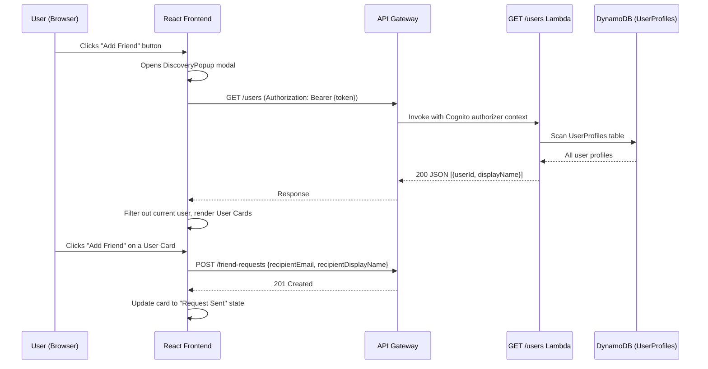

# Design Document: Friend Discovery UI

## Overview

This feature replaces the existing manual "Add Friend" form (which requires both name and email) with an Instagram-style discovery popup that lists all registered users, supports name-based search, and lets users send friend requests with a single button click. It also removes the "Group Chat" entry from the navigation sidebar.

The implementation spans:
- A new backend Lambda handler (`GET /users`) that performs a DynamoDB scan/filter on the UserProfiles table
- A new frontend `useUsersDiscovery` hook for fetching and filtering users
- A `DiscoveryPopup` modal component rendered from the Friends page
- A minor edit to the Layout sidebar `navItems` array and routes

## Architecture



### Key Design Decisions

1. **Client-side search filtering**: The `GET /users` endpoint returns all users (the app is a university study group tool — user count is bounded at hundreds, not millions). Name-based filtering is done client-side for instant responsiveness. An optional `?name=` query param on the backend provides server-side filtering for future scalability.

2. **Reuse existing friend-request flow**: The popup calls the same `POST /friend-requests` endpoint used by the old form. No new mutation endpoints needed.

3. **Relationship state derived from existing hooks**: The popup consumes `useFriends()` and `useFriendRequests()` data to determine whether each listed user is already a friend or has a pending request, avoiding extra API calls.

4. **motion (framer-motion) for animations**: Consistent with the existing `AnimatePresence` + `motion.div` patterns already in `Friends.tsx` and `Layout.tsx`.

## Components and Interfaces

### New Components

| Component | Location | Responsibility |
|-----------|----------|----------------|
| `DiscoveryPopup` | `src/app/components/DiscoveryPopup.tsx` | Modal overlay with search bar and user list |
| `UserCard` | Inline within `DiscoveryPopup` | Single row: avatar initials, display name, action button |

### New Hook

| Hook | Location | Responsibility |
|------|----------|----------------|
| `useUsersDiscovery` | `src/app/hooks/useUsersDiscovery.ts` | Fetches `GET /users`, provides `users`, `isLoading`, `error`, `refresh` |

### New Backend Handler

| Handler | Location | Responsibility |
|---------|----------|----------------|
| `get-users` | `src/handlers/users/get-users.ts` | Scans UserProfiles table, optional name filter, excludes caller |

### Modified Files

| File | Change |
|------|--------|
| `src/app/pages/Friends.tsx` | Replace "Add Friend" button action to open `DiscoveryPopup` instead of inline form |
| `src/app/components/Layout.tsx` | Remove `{ path: "/group-chat", ... }` from `navItems` |
| `src/app/routes.tsx` | Remove `/group-chat` route |
| `packages/shared/src/types/api.ts` | Add `USERS: '/users'` to `API_PATHS`, add `UsersListResponse` type |
| `cdk/lib/api-construct.ts` | Add `GET /users` resource + Lambda integration |
| `cdk/lib/lambda-construct.ts` | Add `getUsersFunction` Lambda |

### Component Props

```typescript
// DiscoveryPopup.tsx
interface DiscoveryPopupProps {
  isOpen: boolean;
  onClose: () => void;
  /** Already-friends IDs — to show "Friends" indicator */
  friendIds: Set<string>;
  /** Pending outgoing request recipient user IDs — to show "Request Sent" */
  pendingRequestUserIds: Set<string>;
  /** Callback when user clicks "Add Friend" on a card */
  onSendRequest: (userId: string, displayName: string, email: string) => Promise<void>;
}
```

### Hook Interface

```typescript
// useUsersDiscovery.ts
interface DiscoverableUser {
  userId: string;
  displayName: string;
}

interface UseUsersDiscoveryReturn {
  users: DiscoverableUser[];
  isLoading: boolean;
  error: string | null;
  refresh: () => Promise<void>;
}

function useUsersDiscovery(): UseUsersDiscoveryReturn;
```

## Data Models

### GET /users Response

```typescript
// Added to @synccircle/shared
interface UsersListResponse {
  users: Array<{
    userId: string;
    displayName: string;
  }>;
}
```

### DynamoDB Access Pattern

The `get-users` Lambda performs a **Scan** on the `UserProfiles` table with a `ProjectionExpression` of `userId, displayName`. The caller's `userId` (from Cognito authorizer context) is excluded via a `FilterExpression`.

When the optional `?name=` query parameter is present, an additional `contains(displayName, :name)` filter is applied (case-insensitive via lowercasing both sides in the Lambda logic before comparison, since DynamoDB `contains` is case-sensitive).

### Existing Data Reuse

- `FriendsListResponse.friends[].friendId` → used to build `friendIds` Set
- `OutgoingRequestsResponse.requests[].recipientEmail` → cross-referenced with user emails to build `pendingRequestUserIds` (alternatively, the backend could return `recipientUserId` which would be simpler — but since the existing outgoing requests only have `recipientEmail`, the popup will match on that field against the user list)

**Design Decision**: To simplify client-side matching of pending requests to user cards, the `GET /users` response will also include the user's `email` field. This allows a straightforward lookup: `outgoing.some(req => req.recipientEmail === user.email)`.

Updated response:
```typescript
interface UsersListResponse {
  users: Array<{
    userId: string;
    displayName: string;
    email: string;
  }>;
}
```


## Correctness Properties

*A property is a characteristic or behavior that should hold true across all valid executions of a system — essentially, a formal statement about what the system should do. Properties serve as the bridge between human-readable specifications and machine-verifiable correctness guarantees.*

### Property 1: Current user exclusion (frontend)

*For any* list of users returned by the API (which may include the current user's ID), the filtered display list SHALL never contain a user whose `userId` matches the current user's ID, and SHALL contain all other users from the source list.

**Validates: Requirements 1.7**

### Property 2: User card button state derivation

*For any* user in the discovery list, given a set of friend IDs and a set of pending outgoing request emails:
- If the user's ID is in the friend set, the derived state SHALL be "friends"
- If the user's email is in the pending request set, the derived state SHALL be "pending"
- Otherwise, the derived state SHALL be "default" (Add Friend)

These three states are mutually exclusive and exhaustive for any user.

**Validates: Requirements 2.3, 2.4**

### Property 3: Client-side search filter correctness

*For any* list of users and any search query string, the filtered result SHALL contain exactly the users whose `displayName.toLowerCase()` includes `query.toLowerCase()`, preserving no false positives and no false negatives.

**Validates: Requirements 4.1, 4.2**

### Property 4: Backend user listing correctness

*For any* set of user profiles in the database, any requesting user ID, and any optional name query parameter:
- The response SHALL exclude the user whose `userId` matches the requester
- When a name query is provided, the response SHALL include only users whose `displayName` (case-insensitive) contains the query
- Every item in the response SHALL contain `userId`, `displayName`, and `email` fields

**Validates: Requirements 5.3, 5.4, 5.5**

## Error Handling

| Scenario | Behavior |
|----------|----------|
| `GET /users` fails (network/500) | `useUsersDiscovery` sets `error` state; popup shows "Failed to load users" message with retry button |
| `POST /friend-requests` fails | Toast error notification via `sonner`; button reverts from loading to "Add Friend" |
| 401 Unauthorized from any endpoint | `UnauthorizedError` caught → triggers `logout()` via auth hook (existing pattern) |
| Empty user list from API | Popup shows empty state: "No registered users found" |
| User tries to add themselves (edge case) | Prevented by frontend filtering (Property 1) and backend exclusion (Property 4) |
| Duplicate friend request (409 PENDING_EXISTS) | `ApiError` with code `PENDING_EXISTS` → toast: "Friend request already sent" |
| Already friends (409 ALREADY_FRIENDS) | `ApiError` with code `ALREADY_FRIENDS` → toast: "You're already friends!" |

### Backend Error Responses

| Status | Code | Condition |
|--------|------|-----------|
| 401 | `UNAUTHORIZED` | Missing/invalid Cognito token (handled by API Gateway authorizer) |
| 500 | `INTERNAL_ERROR` | DynamoDB scan failure |

## Testing Strategy

### Unit Tests (Example-Based)

| Test | What it verifies |
|------|-----------------|
| DiscoveryPopup opens on "Add Friend" click | Requirement 1.1 |
| Close button and backdrop click dismiss popup | Requirements 1.5, 1.6 |
| Escape key dismisses popup | Requirement 7.3 |
| Search bar auto-focuses on open | Requirement 7.4 |
| Empty search results shows message | Requirement 4.4 |
| Loading state shows spinner on button during request | Requirement 3.4 |
| Successful request changes button to "Request Sent" | Requirement 3.2 |
| Failed request shows error toast | Requirement 3.3 |
| Nav sidebar does not include "Group Chat" | Requirements 6.1, 6.2 |
| No /group-chat route registered | Requirement 6.3 |

### Property-Based Tests

Property-based tests will use `fast-check` (already available in the Node ecosystem, compatible with Vitest).

Each test runs a minimum of 100 iterations with randomly generated inputs.

| Test | Property | Tag |
|------|----------|-----|
| Current user never in filtered list | Property 1 | Feature: friend-discovery-ui, Property 1: Current user exclusion |
| Button state matches relationship data | Property 2 | Feature: friend-discovery-ui, Property 2: User card button state derivation |
| Search filter returns exact matches | Property 3 | Feature: friend-discovery-ui, Property 3: Client-side search filter correctness |
| Backend handler returns correct filtered users | Property 4 | Feature: friend-discovery-ui, Property 4: Backend user listing correctness |

### Integration Tests

| Test | What it verifies |
|------|-----------------|
| GET /users returns 200 with valid token | Requirement 5.1 |
| GET /users returns 401 without token | Requirement 5.6 |
| Full flow: open popup → search → send request → button updates | End-to-end user journey |

### Test Configuration

```typescript
// vitest.config.ts (or within test files)
// Property tests: minimum 100 iterations
import fc from 'fast-check';

fc.assert(
  fc.property(/* arbitraries */, (input) => {
    // property check
  }),
  { numRuns: 100 }
);
```
