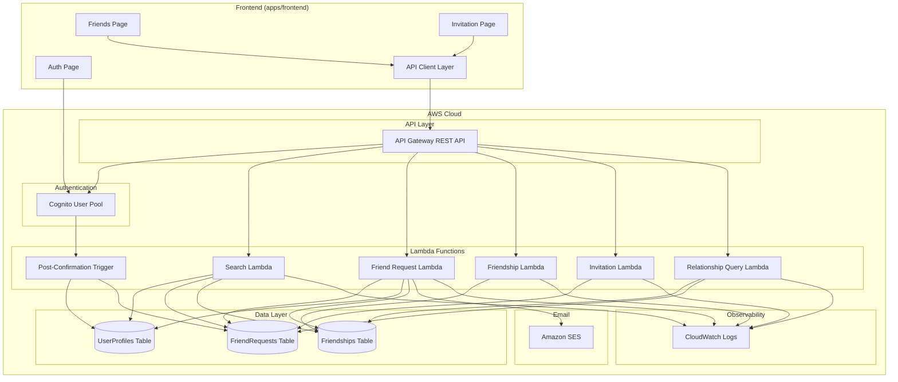
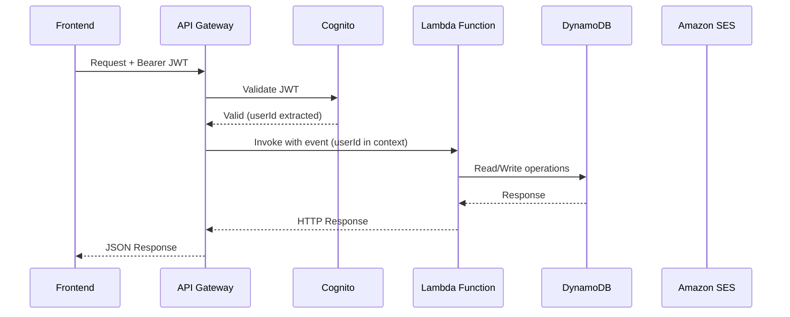
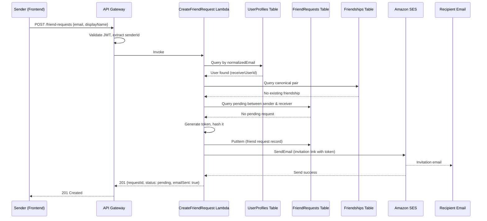
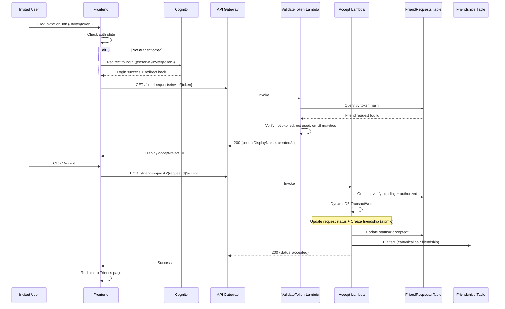
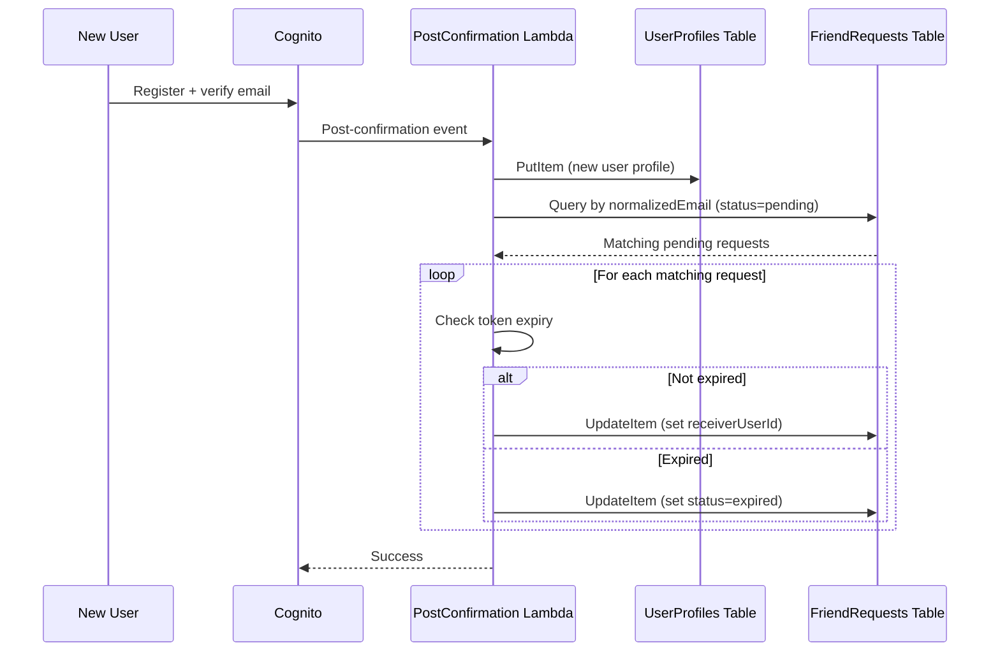

# Design Document: Friends Backend

## Overview

The Friends Backend replaces the existing localStorage-only friends implementation in SyncCircle with a production-grade AWS serverless backend. It provides authenticated user search, a full friend request lifecycle (create, accept, reject, cancel), email invitations via Amazon SES for unregistered users, persistent friendship storage in DynamoDB, and a relationship query API for downstream services (Timetable, AI Planner).

### Key Design Decisions

1. **AWS CDK for IaC** — All infrastructure is defined in TypeScript using AWS CDK, enabling type-safe resource definitions and reproducible deployments in the same language as the Lambda handlers.
2. **Single-table-per-entity DynamoDB** — Three tables (UserProfiles, FriendRequests, Friendships) with GSIs for access patterns. This keeps each table's schema focused and avoids complex single-table designs that hinder team collaboration.
3. **Cognito for auth** — AWS Cognito user pool handles registration, email verification, JWT issuance, and password policy enforcement. API Gateway validates JWTs with zero custom code.
4. **Canonical pair friendships** — Friendships are stored with user IDs in lexicographic order (lower ID first) so that a friendship between any two users is always represented by exactly one record.
5. **Token hashing** — Invitation tokens are stored as SHA-256 hashes in DynamoDB. The plaintext token is only ever in the email link and the validation request. This prevents token leakage even if the database is compromised.
6. **Shared types package** — A `packages/shared/` workspace package exports TypeScript interfaces, API paths, and error codes so frontend and downstream services integrate without reading implementation code.
7. **Idempotent state machine** — Friend request operations (accept/reject/cancel) use conditional DynamoDB writes, making retries safe without client-side deduplication.

## Architecture



### Request Flow



### System Layers

| Layer | Technology | Responsibility |
|-------|-----------|---------------|
| Frontend API Client | fetch + React hooks | Authenticated API calls, error handling, caching |
| API Gateway | AWS API Gateway REST | JWT validation, rate limiting, CORS, request validation |
| Authentication | AWS Cognito | Registration, login, email verification, token issuance |
| Business Logic | AWS Lambda (Node.js 20) | Friend search, request lifecycle, friendship CRUD |
| Data Persistence | DynamoDB (on-demand) | User profiles, friend requests, friendships |
| Email Delivery | Amazon SES | Invitation emails (HTML + plaintext) |
| Observability | CloudWatch | Structured JSON logs, 14-day retention |
| Shared Types | TypeScript package | API contracts, interfaces, error codes |

## Components and Interfaces

### Project Structure

```text
SyncCircle/
├── apps/
│   ├── backend/
│   │   ├── cdk/
│   │   │   ├── bin/app.ts                    # CDK app entry
│   │   │   └── lib/
│   │   │       ├── friends-stack.ts          # Main CDK stack
│   │   │       ├── cognito-construct.ts      # Cognito user pool
│   │   │       ├── api-construct.ts          # API Gateway
│   │   │       ├── lambda-construct.ts       # Lambda functions
│   │   │       ├── dynamodb-construct.ts     # DynamoDB tables
│   │   │       └── ses-construct.ts          # SES configuration
│   │   ├── src/
│   │   │   ├── handlers/
│   │   │   │   ├── search.ts                # POST /friends/search
│   │   │   │   ├── friend-requests/
│   │   │   │   │   ├── create.ts            # POST /friend-requests
│   │   │   │   │   ├── accept.ts            # POST /friend-requests/{id}/accept
│   │   │   │   │   ├── reject.ts            # POST /friend-requests/{id}/reject
│   │   │   │   │   ├── cancel.ts            # POST /friend-requests/{id}/cancel
│   │   │   │   │   ├── incoming.ts          # GET /friend-requests/incoming
│   │   │   │   │   ├── outgoing.ts          # GET /friend-requests/outgoing
│   │   │   │   │   └── validate-token.ts    # GET /friend-requests/invite/{token}
│   │   │   │   ├── friends/
│   │   │   │   │   ├── list.ts              # GET /friends
│   │   │   │   │   ├── remove.ts            # DELETE /friends/{friendId}
│   │   │   │   │   └── relationship.ts      # GET /friends/{friendId}/relationship
│   │   │   │   └── triggers/
│   │   │   │       └── post-confirmation.ts # Cognito post-confirmation
│   │   │   ├── services/
│   │   │   │   ├── email.service.ts         # SES email composition + send
│   │   │   │   ├── token.service.ts         # Token generation + hashing
│   │   │   │   └── validation.service.ts    # Input validation
│   │   │   ├── repositories/
│   │   │   │   ├── user-profile.repo.ts     # UserProfiles DynamoDB ops
│   │   │   │   ├── friend-request.repo.ts   # FriendRequests DynamoDB ops
│   │   │   │   └── friendship.repo.ts       # Friendships DynamoDB ops
│   │   │   ├── utils/
│   │   │   │   ├── canonical-pair.ts        # Canonical user ID ordering
│   │   │   │   ├── response.ts              # HTTP response helpers
│   │   │   │   └── logger.ts                # Structured logging (no PII)
│   │   │   └── types/
│   │   │       └── index.ts                 # Internal handler types
│   │   ├── package.json
│   │   └── tsconfig.json
│   └── frontend/
│       └── src/app/
│           ├── pages/
│           │   ├── Friends.tsx              # Updated Friends page
│           │   └── Invitation.tsx           # New Invitation page
│           ├── hooks/
│           │   ├── useFriendsApi.ts         # Friends API hook
│           │   ├── useFriendRequests.ts     # Friend request hooks
│           │   └── useAuth.ts              # Cognito auth hook
│           └── lib/
│               └── api-client.ts           # Authenticated fetch wrapper
├── packages/
│   └── shared/
│       ├── src/
│       │   ├── types/
│       │   │   ├── user-profile.ts
│       │   │   ├── friend-request.ts
│       │   │   ├── friendship.ts
│       │   │   └── api.ts                  # API paths, error codes
│       │   └── index.ts                    # Barrel export
│       ├── package.json
│       └── tsconfig.json
└── package.json                            # Workspace root
```

### API Design

#### Authentication Endpoints (Cognito-managed)

| Method | Path | Description |
|--------|------|-------------|
| POST | /auth/register | Register with email, password, displayName |
| POST | /auth/confirm | Confirm email verification code |
| POST | /auth/login | Authenticate, receive JWT tokens |
| POST | /auth/refresh | Refresh access token |

#### Friends API Endpoints

| Method | Path | Auth | Description |
|--------|------|------|-------------|
| POST | /friends/search | JWT | Search for user by email + displayName |
| POST | /friend-requests | JWT | Create friend request |
| GET | /friend-requests/incoming | JWT | List incoming pending requests |
| GET | /friend-requests/outgoing | JWT | List outgoing requests (all statuses) |
| POST | /friend-requests/{requestId}/accept | JWT | Accept a friend request |
| POST | /friend-requests/{requestId}/reject | JWT | Reject a friend request |
| POST | /friend-requests/{requestId}/cancel | JWT | Cancel a sent request |
| GET | /friend-requests/invite/{token} | JWT | Validate invitation token |
| GET | /friends | JWT | List active friends |
| DELETE | /friends/{friendId} | JWT | Remove a friendship |
| GET | /friends/{friendId}/relationship | JWT | Query relationship status |

#### Request/Response Contracts

```typescript
// POST /friends/search
interface SearchRequest {
  email: string;       // max 254 chars, valid email format
  displayName: string; // 1-100 chars
}

interface SearchResponse {
  status: 'found' | 'name_mismatch' | 'not_registered' | 'already_friends' | 'pending_request' | 'self_search';
  message: string;
}

// POST /friend-requests
interface CreateFriendRequestRequest {
  recipientEmail: string;   // max 254 chars, valid email format
  recipientDisplayName: string; // 1-100 chars
}

interface CreateFriendRequestResponse {
  requestId: string;
  status: 'pending';
  recipientEmail: string;
  createdAt: string;        // ISO 8601
  emailSent: boolean;
}

// GET /friend-requests/incoming
interface IncomingRequestsResponse {
  requests: Array<{
    requestId: string;
    senderDisplayName: string;
    createdAt: string;      // ISO 8601
  }>;
}

// GET /friend-requests/outgoing
interface OutgoingRequestsResponse {
  requests: Array<{
    requestId: string;
    recipientEmail: string;
    status: 'pending' | 'accepted' | 'rejected' | 'expired' | 'cancelled';
    createdAt: string;      // ISO 8601
  }>;
}

// POST /friend-requests/{requestId}/accept
interface AcceptRejectResponse {
  requestId: string;
  status: 'accepted' | 'rejected' | 'cancelled';
  respondedAt: string;      // ISO 8601
}

// GET /friend-requests/invite/{token}
interface TokenValidationResponse {
  requestId: string;
  senderDisplayName: string;
  createdAt: string;        // ISO 8601
}

// GET /friends
interface FriendsListResponse {
  friends: Array<{
    friendId: string;
    displayName: string;
    createdAt: string;      // ISO 8601 (friendship creation)
  }>;
}

// GET /friends/{friendId}/relationship
interface FriendshipAccessResult {
  friendUserId: string;
  isActiveFriend: boolean;
  relationshipStatus: 'none' | 'pending' | 'active' | 'rejected' | 'removed' | 'blocked';
}

// Error response (all endpoints)
interface ErrorResponse {
  error: string;            // Human-readable message
  code: string;             // Machine-readable error code
  field?: string;           // Which field failed validation (if applicable)
}
```

### Lambda Function Breakdown

| Function | Trigger | DynamoDB Access | Other Services |
|----------|---------|-----------------|----------------|
| PostConfirmation | Cognito post-confirm | UserProfiles (PutItem), FriendRequests (Query, UpdateItem) | — |
| Search | API Gateway | UserProfiles (Query), FriendRequests (Query), Friendships (Query) | — |
| CreateFriendRequest | API Gateway | FriendRequests (PutItem, Query), UserProfiles (Query), Friendships (Query) | SES (SendEmail) |
| AcceptFriendRequest | API Gateway | FriendRequests (GetItem, UpdateItem), Friendships (PutItem) | — |
| RejectFriendRequest | API Gateway | FriendRequests (GetItem, UpdateItem) | — |
| CancelFriendRequest | API Gateway | FriendRequests (GetItem, UpdateItem) | — |
| ListIncoming | API Gateway | FriendRequests (Query), UserProfiles (BatchGetItem) | — |
| ListOutgoing | API Gateway | FriendRequests (Query) | — |
| ValidateToken | API Gateway | FriendRequests (Query), UserProfiles (GetItem) | — |
| ListFriends | API Gateway | Friendships (Query), UserProfiles (BatchGetItem) | — |
| RemoveFriend | API Gateway | Friendships (GetItem, UpdateItem) | — |
| RelationshipQuery | API Gateway | Friendships (Query), FriendRequests (Query) | — |

### Sequence Diagrams

#### Friend Request Flow (Registered Recipient)



#### Invitation Link Accept Flow



#### Unregistered Recipient Registration Flow



## Data Models

### DynamoDB Table: UserProfiles

| Attribute | Type | Key | Description |
|-----------|------|-----|-------------|
| userId | String | PK | Cognito sub (UUID) |
| email | String | — | Original email |
| normalizedEmail | String | GSI-PK | Lowercase-trimmed email |
| displayName | String | — | 1-50 characters |
| course | String | — | Optional, max 100 chars |
| createdAt | String | — | ISO 8601 |
| updatedAt | String | — | ISO 8601 |

**GSI: normalizedEmail-index**
- Partition Key: `normalizedEmail`
- Projection: ALL

### DynamoDB Table: FriendRequests

| Attribute | Type | Key | Description |
|-----------|------|-----|-------------|
| requestId | String | PK | UUID v4 |
| senderUserId | String | GSI-PK | Sender's Cognito sub |
| receiverUserId | String | GSI-PK | Receiver's Cognito sub (empty if unregistered) |
| receiverEmail | String | — | Recipient email address |
| normalizedReceiverEmail | String | GSI-PK | Lowercase-trimmed recipient email |
| senderDisplayName | String | — | Cached sender name at time of request |
| status | String | — | pending, accepted, rejected, expired, cancelled |
| tokenHash | String | — | SHA-256 hash of invitation token |
| tokenExpiresAt | String | — | ISO 8601, 7 days from creation |
| createdAt | String | GSI-SK | ISO 8601 |
| respondedAt | String | — | ISO 8601 (set on accept/reject/cancel) |

**GSI: senderUserId-createdAt-index**
- Partition Key: `senderUserId`
- Sort Key: `createdAt`
- Projection: ALL

**GSI: receiverUserId-createdAt-index**
- Partition Key: `receiverUserId`
- Sort Key: `createdAt`
- Projection: ALL

**GSI: normalizedReceiverEmail-index**
- Partition Key: `normalizedReceiverEmail`
- Sort Key: `createdAt`
- Projection: ALL

**GSI: tokenHash-index**
- Partition Key: `tokenHash`
- Projection: ALL

### DynamoDB Table: Friendships

| Attribute | Type | Key | Description |
|-----------|------|-----|-------------|
| friendshipId | String | PK | UUID v4 |
| userIdLow | String | GSI-PK | Lexicographically lower user ID (canonical pair) |
| userIdHigh | String | GSI-PK | Lexicographically higher user ID (canonical pair) |
| status | String | — | active, removed, blocked |
| createdAt | String | — | ISO 8601 |
| updatedAt | String | — | ISO 8601 |

**GSI: userIdLow-index**
- Partition Key: `userIdLow`
- Projection: ALL

**GSI: userIdHigh-index**
- Partition Key: `userIdHigh`
- Projection: ALL

**Canonical Pair Logic:**
```typescript
function canonicalPair(userA: string, userB: string): { userIdLow: string; userIdHigh: string } {
  return userA < userB
    ? { userIdLow: userA, userIdHigh: userB }
    : { userIdLow: userB, userIdHigh: userA };
}
```

### Cognito User Pool Configuration

| Setting | Value |
|---------|-------|
| Sign-in aliases | Email |
| Auto-verify | Email |
| MFA | Optional (TOTP) |
| Password policy | Min 8, uppercase, lowercase, number, special char |
| Custom attributes | displayName (string), course (string) |
| Lambda triggers | Post-confirmation → PostConfirmation Lambda |
| Token validity | Access: 1h, Refresh: 30d |


## Correctness Properties

*A property is a characteristic or behavior that should hold true across all valid executions of a system — essentially, a formal statement about what the system should do. Properties serve as the bridge between human-readable specifications and machine-verifiable correctness guarantees.*

### Property 1: Email normalization is idempotent and correct

*For any* email string, normalizing it SHALL produce a lowercase, whitespace-trimmed result, and normalizing an already-normalized email SHALL return the same value (idempotent). Additionally, `normalize(email) === email.trim().toLowerCase()` for all inputs.

**Validates: Requirements 3.2, 4.1**

### Property 2: Input validation rejects all invalid inputs

*For any* string that is empty when a non-empty value is required, OR any email string that does not match a valid email format, OR any email string exceeding 254 characters, OR any displayName exceeding 100 characters, OR any course exceeding 100 characters, the validation service SHALL reject the input and return an error indicating which field failed.

**Validates: Requirements 3.4, 4.8, 4.9, 5.11, 17.2**

### Property 3: Self-action prevention

*For any* user, attempting to search for their own email or send a friend request to their own email (after normalization) SHALL be rejected with an appropriate error, regardless of display name or other parameters.

**Validates: Requirements 4.5, 5.4**

### Property 4: Display name comparison is case-insensitive and trim-invariant

*For any* two display name strings, the search comparison SHALL consider them matching if and only if they are equal after both are trimmed and lowercased. Adding or removing leading/trailing whitespace or changing case SHALL NOT affect the match result.

**Validates: Requirements 4.2**

### Property 5: Canonical pair ordering is deterministic and commutative

*For any* two distinct user IDs A and B, `canonicalPair(A, B)` SHALL equal `canonicalPair(B, A)`, and the result SHALL always have the lexicographically smaller ID as `userIdLow`. This guarantees exactly one friendship record per user pair regardless of operation order.

**Validates: Requirements 9.3, 1.4**

### Property 6: Invitation token security

*For any* generated invitation token, the token SHALL be at least 32 bytes of randomness, the stored `tokenHash` SHALL NOT equal the plaintext token, and `hash(token) === tokenHash`. No two generated tokens SHALL be equal (with overwhelming probability).

**Validates: Requirements 5.8**

### Property 7: Token expiry enforcement

*For any* friend request whose `tokenExpiresAt` timestamp is earlier than the current server time, the system SHALL treat the token as expired — returning an expiry error on validation, marking it as expired in list responses, and refusing to attach it to a newly registered user.

**Validates: Requirements 7.5, 8.4, 12.3**

### Property 8: Token validation rejects non-matching hashes

*For any* string that does not match a stored `tokenHash` value when hashed, the invitation validation endpoint SHALL return an invalid-token error.

**Validates: Requirements 7.7**

### Property 9: Recipient email enforcement on invitation actions

*For any* authenticated user whose normalized email does not match the `normalizedReceiverEmail` on a friend request, attempting to accept or reject via the invitation flow SHALL be rejected with a wrong-recipient error.

**Validates: Requirements 7.8**

### Property 10: Authorization enforcement (correct actor only)

*For any* friend request, only the `receiverUserId` can accept or reject, and only the `senderUserId` can cancel. For any friendship, only a user in the canonical pair can remove it. All other users SHALL receive HTTP 403.

**Validates: Requirements 9.5, 10.2, 11.2, 14.4**

### Property 11: Status precondition enforcement

*For any* friend request whose status is NOT "pending", attempting to accept, reject, or cancel SHALL return HTTP 409. The operation SHALL NOT modify the stored record.

**Validates: Requirements 9.6, 10.3, 11.3**

### Property 12: Non-existent resource returns 404

*For any* requestId or friendId that does not exist in the data store, operations targeting that resource SHALL return HTTP 404.

**Validates: Requirements 9.7, 10.4, 11.4**

### Property 13: State transitions set correct fields

*For any* pending friend request, accepting it SHALL set `status = "accepted"` and `respondedAt` to a valid ISO 8601 timestamp. Rejecting SHALL set `status = "rejected"` and `respondedAt`. Cancelling SHALL set `status = "cancelled"`. Removing a friendship SHALL set `status = "removed"` and `updatedAt`.

**Validates: Requirements 9.1, 10.1, 11.1, 14.1**

### Property 14: Idempotent operations

*For any* friend request that has already been accepted, a subsequent accept call by the same user SHALL return success without creating a duplicate Friendship record. The same holds for re-rejecting an already-rejected request and re-cancelling an already-cancelled request. However, calling an incompatible operation (e.g., accept on a cancelled request) SHALL return an error without modifying state.

**Validates: Requirements 16.1, 16.2, 16.3, 16.4**

### Property 15: Duplicate request prevention

*For any* pair of users where a pending friend request already exists in either direction, creating a new friend request between them SHALL be rejected. Creating a request between users who already have an active friendship SHALL also be rejected.

**Validates: Requirements 5.5, 5.6**

### Property 16: Pending request attachment on registration

*For any* newly registered user, all pending (non-expired) friend requests matching their normalized email SHALL have their `receiverUserId` set to the new user's ID. Expired requests SHALL be marked as "expired" and NOT attached.

**Validates: Requirements 8.2, 8.4**

### Property 17: List filtering correctness

*For any* set of friend request records, GET /friend-requests/incoming for user X SHALL return only records where `receiverUserId === X` AND `status === "pending"`. GET /friend-requests/outgoing for user X SHALL return only records where `senderUserId === X`. Results SHALL be sorted by `createdAt` descending and limited to 100 records.

**Validates: Requirements 12.1, 12.2, 12.4, 12.6**

### Property 18: Friends list returns only active friendships

*For any* set of friendship records, GET /friends for user X SHALL return only records where (X is in the canonical pair) AND (`status === "active"`). Removed or blocked friendships SHALL NOT appear.

**Validates: Requirements 13.1, 13.2, 14.2**

### Property 19: Relationship query consistency

*For any* pair of users, the relationship query SHALL return `isActiveFriend === true` if and only if `relationshipStatus === "active"`. For all other statuses (none, pending, rejected, removed, blocked), `isActiveFriend` SHALL be `false`. The returned `relationshipStatus` SHALL always be one of the defined enum values.

**Validates: Requirements 15.1, 15.2, 15.3, 15.4**

### Property 20: Email composition completeness

*For any* friend request with a sender display name and invitation token, the composed email SHALL contain: the sender's display name, the application name "SyncCircle", a clickable invitation link constructed from the configured base URL with the token as a query parameter, the 7-day expiry duration, and both HTML and plain text content parts.

**Validates: Requirements 6.2, 6.3, 6.6**

### Property 21: ISO 8601 timestamp format

*For any* API response containing timestamp fields (createdAt, updatedAt, respondedAt, tokenExpiresAt), all values SHALL be valid ISO 8601 datetime strings parseable by `new Date()`.

**Validates: Requirements 17.6**

### Property 22: No internal data leakage in API responses

*For any* API response, the response body SHALL NOT contain `tokenHash`, database partition keys (unless they are the public-facing ID), internal service identifiers, or plaintext email addresses of users other than the authenticated caller (except `recipientEmail` in the sender's own outgoing requests).

**Validates: Requirements 17.7, 1.6**

## Error Handling

### Error Response Format

All error responses follow a consistent structure:

```typescript
interface ErrorResponse {
  error: string;   // Human-readable description
  code: string;    // Machine-readable error code (e.g., "VALIDATION_ERROR")
  field?: string;  // Which field failed (for validation errors)
}
```

### Error Codes

| Code | HTTP Status | Description |
|------|-------------|-------------|
| `VALIDATION_ERROR` | 400 | Input validation failure |
| `UNAUTHORIZED` | 401 | Missing or invalid JWT |
| `FORBIDDEN` | 403 | Authenticated but not authorized for this action |
| `NOT_FOUND` | 404 | Resource does not exist |
| `CONFLICT` | 409 | Operation conflicts with current state |
| `RATE_LIMITED` | 429 | Too many requests |
| `SELF_REQUEST` | 400 | Cannot send request to yourself |
| `ALREADY_FRIENDS` | 409 | Friendship already exists |
| `PENDING_EXISTS` | 409 | Pending request already exists |
| `TOKEN_EXPIRED` | 410 | Invitation token has expired |
| `TOKEN_USED` | 410 | Invitation token already consumed |
| `TOKEN_INVALID` | 400 | Token malformed or not found |
| `WRONG_RECIPIENT` | 403 | Authenticated user is not the intended recipient |
| `EMAIL_FAILED` | 202 | Request created but email delivery failed |
| `INTERNAL_ERROR` | 500 | Unexpected server error |

### Error Handling Strategy by Layer

| Layer | Strategy |
|-------|----------|
| API Gateway | Schema validation rejects before Lambda invocation |
| Lambda Handler | Try/catch at top level, structured error logging |
| Validation Service | Returns `{ valid: false, errors: [...] }` before any DB access |
| Repository Layer | Catches DynamoDB errors, translates to domain errors |
| Email Service | Catches SES errors, returns `emailSent: false` (non-blocking) |
| Frontend | Toast notifications for failures, no technical details exposed |

### Retry and Resilience

- **DynamoDB conditional write failures**: Retry up to 3 times with exponential backoff
- **SES send failures**: Do NOT retry automatically; log failure, return partial success to user
- **Token validation race conditions**: Conditional writes ensure exactly-once state transitions
- **Frontend network errors**: Show error toast, preserve current UI state, allow manual retry

### Structured Logging

```typescript
// Logger strips PII before writing
interface LogEntry {
  level: 'INFO' | 'WARN' | 'ERROR';
  message: string;
  requestId: string;       // API Gateway request ID
  userId?: string;         // Authenticated user (Cognito sub)
  action: string;          // e.g., "FRIEND_REQUEST_CREATE"
  duration?: number;       // ms
  error?: {
    code: string;
    message: string;       // No PII
  };
  // NEVER logged: email addresses, tokens, passwords
}
```

## Testing Strategy

### Testing Approach

The project uses a dual testing strategy combining property-based tests for universal correctness guarantees with example-based tests for specific scenarios and integration verification.

### Property-Based Testing

- **Library**: `fast-check` with Vitest as the test runner
- **Runtime**: Node.js 20 (matching Lambda runtime)
- **Location**: `SyncCircle/apps/backend/tests/properties/`
- **Configuration**: Each property test runs minimum 100 iterations
- **Tagging**: Each test is annotated with `// Feature: friends-backend, Property N: <title>`

Property tests target the pure business logic layer (services, utilities, repositories with mocked DynamoDB):

| Test File | Properties Covered |
|-----------|-------------------|
| `canonical-pair.property.test.ts` | Property 5 |
| `email-normalization.property.test.ts` | Property 1 |
| `validation.property.test.ts` | Properties 2, 3 |
| `display-name-match.property.test.ts` | Property 4 |
| `token.property.test.ts` | Properties 6, 7, 8 |
| `authorization.property.test.ts` | Properties 9, 10, 11, 12 |
| `state-transitions.property.test.ts` | Properties 13, 14 |
| `duplicate-prevention.property.test.ts` | Property 15 |
| `registration-attach.property.test.ts` | Property 16 |
| `list-filtering.property.test.ts` | Properties 17, 18 |
| `relationship-query.property.test.ts` | Property 19 |
| `email-composition.property.test.ts` | Property 20 |
| `response-format.property.test.ts` | Properties 21, 22 |

### Unit Tests (Example-Based)

- **Framework**: Vitest
- **Location**: `SyncCircle/apps/backend/tests/unit/`
- **Focus**: Specific scenarios, edge cases, error paths

Unit tests cover:
- Search scenarios (name mismatch, not registered, already friends, pending)
- Friend request creation with registered vs unregistered recipients
- Email send failure handling (partial success response)
- Token already used / already responded scenarios
- Empty list edge cases
- Rate limit response format
- Frontend component rendering (React Testing Library)

### Integration Tests

- **Framework**: Vitest + AWS SDK mocks (aws-sdk-client-mock)
- **Location**: `SyncCircle/apps/backend/tests/integration/`
- **Focus**: DynamoDB transactions, Cognito trigger flow, SES integration

Integration tests verify:
- DynamoDB TransactWriteItems for accept flow (atomic friendship creation)
- Post-confirmation trigger attaches pending requests
- Conditional writes prevent duplicate friendships
- SES email format (multipart MIME)
- API Gateway request validation (invalid schemas rejected before Lambda)

### CDK Infrastructure Tests

- **Framework**: AWS CDK assertions (`aws-cdk-lib/assertions`)
- **Location**: `SyncCircle/apps/backend/tests/cdk/`
- **Focus**: Resource configuration verification

CDK tests verify:
- DynamoDB table schemas and GSI configurations
- IAM policy statements (least-privilege)
- Lambda function configurations (runtime, timeout, env vars)
- API Gateway authorizer configuration
- CloudWatch log group retention
- CORS configuration

### Frontend Tests

- **Framework**: Vitest + React Testing Library
- **Location**: `SyncCircle/apps/frontend/tests/`
- **Focus**: Page rendering, API integration, error states

Frontend tests cover:
- Friends page loads all sections with loading states
- Add Friend form validation (client-side)
- Error toast on API failure (no fallback to localStorage)
- Invitation page auth redirect flow
- Invitation page accept/reject UI

### Test File Structure

```text
SyncCircle/
├── apps/
│   ├── backend/
│   │   └── tests/
│   │       ├── properties/
│   │       │   ├── canonical-pair.property.test.ts
│   │       │   ├── email-normalization.property.test.ts
│   │       │   ├── validation.property.test.ts
│   │       │   ├── display-name-match.property.test.ts
│   │       │   ├── token.property.test.ts
│   │       │   ├── authorization.property.test.ts
│   │       │   ├── state-transitions.property.test.ts
│   │       │   ├── duplicate-prevention.property.test.ts
│   │       │   ├── registration-attach.property.test.ts
│   │       │   ├── list-filtering.property.test.ts
│   │       │   ├── relationship-query.property.test.ts
│   │       │   ├── email-composition.property.test.ts
│   │       │   └── response-format.property.test.ts
│   │       ├── unit/
│   │       │   ├── search.test.ts
│   │       │   ├── create-request.test.ts
│   │       │   ├── accept-request.test.ts
│   │       │   ├── reject-request.test.ts
│   │       │   ├── cancel-request.test.ts
│   │       │   ├── list-requests.test.ts
│   │       │   ├── validate-token.test.ts
│   │       │   ├── list-friends.test.ts
│   │       │   ├── remove-friend.test.ts
│   │       │   └── relationship.test.ts
│   │       ├── integration/
│   │       │   ├── accept-transaction.test.ts
│   │       │   ├── post-confirmation.test.ts
│   │       │   ├── conditional-writes.test.ts
│   │       │   └── ses-email.test.ts
│   │       └── cdk/
│   │           └── friends-stack.test.ts
│   └── frontend/
│       └── tests/
│           ├── pages/
│           │   ├── Friends.test.tsx
│           │   └── Invitation.test.tsx
│           └── hooks/
│               └── useFriendsApi.test.ts
└── packages/
    └── shared/
        └── tests/
            └── types.test.ts
```
