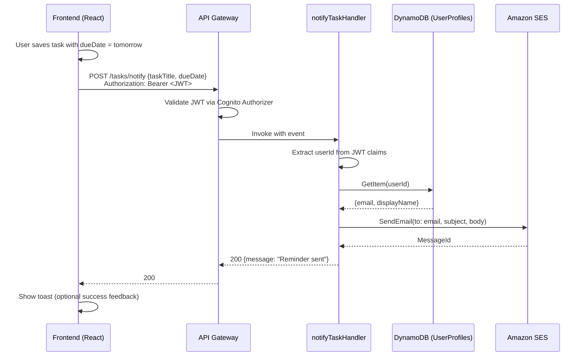
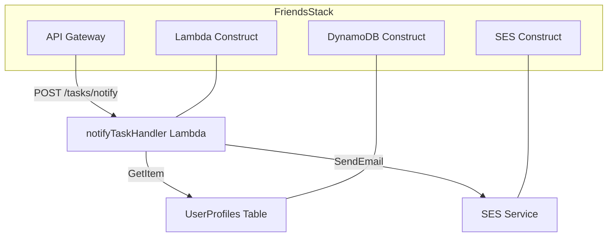

# Design Document: Task Email Reminders

## Overview

This feature adds an AWS-native email reminder system for tasks due the next day. When a user saves a task with tomorrow's due date, the frontend calls a new `POST /tasks/notify` API endpoint. A dedicated Lambda function extracts the user identity from the Cognito JWT, looks up their email in the UserProfiles DynamoDB table, and sends a formatted reminder email via Amazon SES.

The design replaces the existing Workato webhook approach with a fully serverless, in-account solution. The existing in-app toast notifications remain completely untouched and operate independently.

**Key Design Decisions:**
- **Frontend-triggered**: The frontend determines "tomorrow" in local time and initiates the request on save, keeping the Lambda stateless and simple.
- **No scheduled jobs**: No EventBridge rules or cron-based Lambda invocations needed — the trigger is the user's save action.
- **EMAIL_ADAPTER = ''**: The new notify Lambda explicitly sets `EMAIL_ADAPTER` to empty string so real SES emails are sent, unlike other Lambdas that use `'local'` for development.
- **Fire-and-forget on frontend**: Email failures are swallowed on the frontend to avoid disrupting the task-saving UX.

## Architecture



**Infrastructure topology:**



## Components and Interfaces

### 1. Frontend: Task Notification Trigger

**File:** `apps/frontend/src/app/lib/task-notify-client.ts`

```typescript
export interface NotifyTaskRequest {
  taskTitle: string;
  dueDate: string; // ISO 8601 date: YYYY-MM-DD
}

export interface NotifyTaskResponse {
  message: string;
}

/**
 * Sends a task reminder email request to the backend.
 * Fires only when dueDate equals tomorrow in user's local timezone.
 * Failures are silently swallowed — email is best-effort.
 */
export async function notifyTaskDueTomorrow(task: { title: string; dueDate: string }): Promise<void>;
```

**Integration point:** Called from the existing `fireDeadlineEmailIfTomorrow` function in `useTaskNotifications.ts`, replacing the Workato webhook call.

### 2. Shared Types

**File:** `packages/shared/src/types/api.ts` (additions)

```typescript
// Added to API_PATHS
TASKS_NOTIFY: '/tasks/notify',

// Request/Response types
export interface NotifyTaskRequest {
  taskTitle: string;
  dueDate: string; // YYYY-MM-DD
}

export interface NotifyTaskResponse {
  message: string;
}
```

### 3. Lambda Handler: notifyTaskHandler

**File:** `apps/backend/src/handlers/tasks/notify.ts`

```typescript
import type { APIGatewayProxyEvent, APIGatewayProxyResult } from 'aws-lambda';

export async function handler(event: APIGatewayProxyEvent): Promise<APIGatewayProxyResult>;
```

**Responsibilities:**
1. Parse and validate request body (`taskTitle`, `dueDate`)
2. Extract `userId` from `event.requestContext.authorizer.claims.sub`
3. Query UserProfiles table for user's email
4. Compose and send email via SES
5. Return appropriate HTTP status codes

### 4. CDK Infrastructure Additions

**Lambda Construct changes:**
- New `notifyTaskHandler` NodejsFunction
- Environment: `USER_PROFILES_TABLE`, `SES_SENDER_EMAIL`, `EMAIL_ADAPTER: ''`
- IAM: `dynamodb:GetItem` on UserProfiles, `ses:SendEmail` restricted to sender

**API Construct changes:**
- New route: `POST /tasks/notify` → `notifyTaskHandler` with Cognito authorizer
- Request validation model for `taskTitle` + `dueDate`

## Data Models

### Request Body: POST /tasks/notify

| Field | Type | Constraints | Description |
|-------|------|-------------|-------------|
| `taskTitle` | string | Non-empty, max 200 chars | The title of the task due tomorrow |
| `dueDate` | string | ISO 8601 date (YYYY-MM-DD) | The task's due date |

### UserProfiles Table (existing, read-only access)

| Attribute | Type | Description |
|-----------|------|-------------|
| `userId` (PK) | string | Cognito user sub |
| `email` | string | User's registered email |
| `displayName` | string | User's display name |

### Email Template

| Field | Content |
|-------|---------|
| **From** | `noreply@synccircle.com` |
| **To** | User's registered email from UserProfiles |
| **Subject** | `Reminder: "{taskTitle}" is due on {formattedDate}` |
| **Body** | Friendly reminder with task title and due date |

### Response: 200 Success

```json
{
  "message": "Reminder email sent successfully"
}
```

### Response: Error Cases

| Status | Condition | Body |
|--------|-----------|------|
| 400 | Missing/invalid `taskTitle` or `dueDate` | `{ "error": "...", "code": "VALIDATION_ERROR" }` |
| 401 | Missing/invalid JWT | Handled by API Gateway Cognito authorizer |
| 404 | User profile not found | `{ "error": "User profile not found", "code": "NOT_FOUND" }` |
| 500 | SES send failure | `{ "error": "Failed to send reminder email", "code": "INTERNAL_ERROR" }` |


## Correctness Properties

*A property is a characteristic or behavior that should hold true across all valid executions of a system — essentially, a formal statement about what the system should do. Properties serve as the bridge between human-readable specifications and machine-verifiable correctness guarantees.*

### Property 1: Tomorrow Detection Biconditional

*For any* current date and *for any* task due date, the notification trigger function SHALL fire a request if and only if the due date equals the next calendar day relative to the current date (in the user's local timezone).

**Validates: Requirements 1.1, 1.2**

### Property 2: Request Body Validation

*For any* request body, the validation function SHALL accept the input if and only if `taskTitle` is a non-empty string (max 200 characters) AND `dueDate` matches the ISO 8601 date format `YYYY-MM-DD` with valid month/day values. All other inputs SHALL be rejected.

**Validates: Requirements 2.2, 2.3**

### Property 3: Email Composition Contains Required Fields

*For any* valid task title and *for any* valid due date string, the composed email subject SHALL contain the task title and the formatted due date, AND the composed email body SHALL contain the task title and the due date.

**Validates: Requirements 4.2, 4.3**

## Error Handling

| Scenario | Handler | Behavior |
|----------|---------|----------|
| Invalid JSON body | Lambda | Return 400 with `VALIDATION_ERROR` code |
| Missing `taskTitle` | Lambda | Return 400 with `VALIDATION_ERROR` code, field: `taskTitle` |
| Empty `taskTitle` | Lambda | Return 400 with `VALIDATION_ERROR` code, field: `taskTitle` |
| Invalid `dueDate` format | Lambda | Return 400 with `VALIDATION_ERROR` code, field: `dueDate` |
| Missing JWT / invalid token | API Gateway | Return 401 (Cognito authorizer) |
| User profile not found in DynamoDB | Lambda | Return 404 with `NOT_FOUND` code |
| DynamoDB service error | Lambda | Return 500 with `INTERNAL_ERROR` code |
| SES send failure | Lambda | Return 500 with message "Failed to send reminder email" |
| SES throttling | Lambda | Return 500 (same as SES failure) |
| Frontend receives non-200 from /tasks/notify | Frontend | Swallow error silently, continue with in-app toast |
| Network timeout on /tasks/notify call | Frontend | Swallow error silently, continue with in-app toast |

**Error design rationale:**
- The Lambda follows the existing `success()/error()` response utility pattern from `apps/backend/src/utils/response.ts`.
- The frontend treats email notification as best-effort — failures never block the user's task-saving workflow or show error UI.
- The existing `useTaskNotifications` toast system remains completely independent of the email path's success/failure.

## Testing Strategy

### Unit Tests (vitest)

| Test | Description |
|------|-------------|
| Lambda: valid request → 200 | Mock DDB + SES, verify success path |
| Lambda: missing taskTitle → 400 | Verify validation rejects empty title |
| Lambda: invalid dueDate → 400 | Verify validation rejects bad date format |
| Lambda: user not found → 404 | Mock DDB returning no item |
| Lambda: SES failure → 500 | Mock SES throwing error |
| Lambda: userId extraction | Verify claims.sub is correctly read |
| Frontend: triggers on tomorrow | Verify API call fires for tomorrow's date |
| Frontend: does not trigger for other dates | Verify no API call for today/past/far-future |
| Frontend: swallows API errors | Verify no error UI on fetch failure |

### Property-Based Tests (fast-check + vitest)

The project already has `fast-check` as a dev dependency. Property tests validate the three correctness properties above:

- **Property 1**: Generate random `Date` pairs (current, dueDate). Assert the trigger function returns `true` iff dueDate is exactly one day after current date.
- **Property 2**: Generate random objects with various field combinations. Assert the validator returns valid iff taskTitle is non-empty string ≤200 chars AND dueDate matches `YYYY-MM-DD` with valid calendar values.
- **Property 3**: Generate random non-empty strings (taskTitle) and valid date strings. Assert the composed subject and body both contain the taskTitle and formatted dueDate.

**Configuration:**
- Minimum 100 iterations per property test
- Tag format: `Feature: task-email-reminders, Property {N}: {description}`

### CDK Assertion Tests

| Test | Description |
|------|-------------|
| Lambda resource exists | NodejsFunction with Node.js 20 runtime |
| IAM: DynamoDB GetItem | Policy grants GetItem on UserProfiles |
| IAM: SES SendEmail | Policy grants SendEmail with sender condition |
| Environment: EMAIL_ADAPTER | Set to empty string |
| API route: POST /tasks/notify | Route exists with Cognito authorizer |

### Integration Tests (manual/deploy-time)

| Test | Description |
|------|-------------|
| End-to-end happy path | Save task due tomorrow → receive email |
| Auth rejection | Call /tasks/notify without token → 401 |
| Sandbox constraint | Send to unverified recipient → SES error handled |
